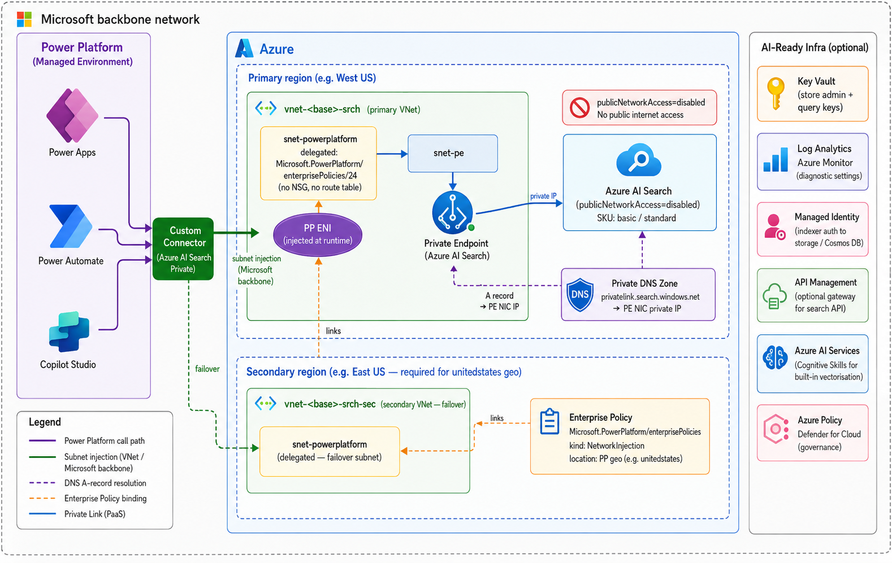

# Azure AI Search behind Private Endpoint + Power Platform

## Objective

Provide an end-to-end accelerator for hosting **Azure AI Search** behind a
**Private Endpoint** (no public network access) and querying it from a **Power
Platform Managed Environment** via [Enterprise Policy / VNet
injection](https://learn.microsoft.com/power-platform/admin/vnet-support-setup-configure).

> **Why not just use `bypass=AzureServices`?** Power Platform is not on the
> trusted-services list for Azure AI Search. `networkRuleSet.bypass` only covers
> services like Azure Machine Learning and Azure Cognitive Services indexers —
> not Power Automate or Power Apps runtime calls. A Power Platform Enterprise
> Policy linked to a delegated subnet is the supported bridge.

What you get when you finish the steps below:

* `Microsoft.Search/searchServices` with `publicNetworkAccess=Disabled`, optional
  system-assigned identity, and a Private Endpoint into a dedicated subnet.
* One Private DNS zone linked to the primary VNet:
  `privatelink.search.windows.net`.
* Two delegated subnets in paired Azure regions for Power Platform VNet
  injection (multi-region PP geos like `unitedstates` require subnets in two
  regions).
* `Microsoft.PowerPlatform/enterprisePolicies` (kind `NetworkInjection`)
  referencing both delegated subnets, linked to your Managed PP environment.
* A Power Platform **custom connector** for the AI Search query REST API (search
  documents, get document, list indexes) that routes through the private endpoint
  when called from a Power Automate flow in the linked environment.

## Architecture



The architecture diagram source is at [docs/aisearch-architecture.drawio](docs/aisearch-architecture.drawio).

## Getting Started

### Prerequisites

| Requirement | Notes |
|---|---|
| [Azure subscription](https://azure.microsoft.com/free/) Owner / Contributor | RG, networking, AI Search, PE, DNS, Enterprise Policy |
| [Azure CLI](https://learn.microsoft.com/cli/azure/install-azure-cli) ≥ `2.50` | Only required for scripted path |
| [PowerShell 7+](https://learn.microsoft.com/powershell/scripting/install/installing-powershell) (`pwsh`) | For helper scripts |
| [`pac` CLI](https://learn.microsoft.com/power-platform/developer/cli/introduction#install-microsoft-power-platform-cli) signed in to target PP environment | `pac auth list` |
| [`Microsoft.PowerPlatform.EnterprisePolicies` PowerShell module](https://www.powershellgallery.com/packages/Microsoft.PowerPlatform.EnterprisePolicies) | Auto-installed by `link-enterprise-policy.ps1` |
| [Power Platform / Global Administrator](https://learn.microsoft.com/power-platform/admin/use-service-admin-role-manage-tenant) | Required to enable Managed Environment + link the policy |
| Target environment is a [**Managed Environment**](https://learn.microsoft.com/power-platform/admin/managed-environment-overview) | Sandbox is not allowed; enable in PPAC |
| AI Search SKU must be **Basic or above** | Free tier does **not** support private endpoints |

> **Existing AI Search?** If you already have an AI Search service and only
> need to put it behind a private endpoint, set `provisionAiSearch=false` and
> supply `existingAiSearchResourceId` with the full ARM resource ID. The
> template will skip creating the search service and provision the network
> resources (VNet, PE, DNS, Enterprise Policy) only.

### Deployment

#### Step 1 — Clone the repository

```powershell
git clone https://github.com/<org>/Copilot-Studio-and-Azure.git
cd Copilot-Studio-and-Azure/accelerators/private-endpoint/ai-search
```

#### Step 2 — Copy `.env.example` to `.env` and fill in your values

```powershell
Copy-Item .env.example .env
# edit .env in your editor
```

| Variable | What to put here |
|---|---|
| `AZURE_SUBSCRIPTION_ID` | GUID of the Azure subscription |
| `AZURE_RESOURCE_GROUP` | Resource group name (created if it doesn't exist) |
| `BASE_NAME` | 3–11 chars, lowercase alphanumerics |
| `PP_TENANT_ID` | Microsoft Entra tenant ID |
| `PP_ENVIRONMENT_ID` | Power Platform environment GUID |
| `PP_GEO` | Power Platform region (`unitedstates`, `europe`, …) |
| `ENTERPRISE_POLICY_NAME` | Name for the Enterprise Policy resource |
| `PROVISION_AI_SEARCH` | `true` to create a new search service, `false` to use existing |
| `EXISTING_AI_SEARCH_RESOURCE_ID` | Full ARM resource ID — only when `PROVISION_AI_SEARCH=false` |
| `AI_SEARCH_SKU` | `basic` (default), `standard`, `standard2`, `standard3` |

#### Step 3 — Provision the infrastructure

Pick **one** of the two options below, then continue with the linking step.

##### Option A — One-click ARM deploy (recommended)

[](https://portal.azure.com/#create/Microsoft.Template/uri/https%3A%2F%2Fraw.githubusercontent.com%2F<org>%2FCopilot-Studio-and-Azure%2Fmain%2Faccelerators%2Fprivate-endpoint%2Fai-search%2Finfra%2Fazuredeploy-aisearch.json)

The portal blade collects:

| Parameter | Description | Example |
|---|---|---|
| `baseName` | 3–11 chars, lowercase alphanumerics | `pvsrch` |
| `powerPlatformRegion` | PP geo. Drives primary/secondary Azure regions. | `unitedstates` |
| `powerPlatformEnvironmentId` | GUID of the target PP environment | `00000000-…` |
| `provisionAiSearch` | `true` (default) to create a new search service; `false` to use existing | `true` |
| `existingAiSearchResourceId` | Full ARM resource ID of existing search service (when `provisionAiSearch=false`) | `/subscriptions/…/providers/Microsoft.Search/searchServices/<name>` |
| `aiSearchSku` | SKU for the new search service | `basic` |
| `replicaCount` / `partitionCount` | Scale settings (basic: max 3 replicas, 1 partition) | `1` / `1` |
| `vnetAddressPrefix` / `peSubnetPrefix` / `ppSubnetPrefix` | Primary VNet + subnet CIDRs | `10.60.0.0/16` / `10.60.1.0/24` / `10.60.2.0/24` |
| `secondaryVnetAddressPrefix` / `secondaryPpSubnetPrefix` | Secondary VNet + delegated subnet (ignored for single-region geos) | `10.61.0.0/16` / `10.61.2.0/24` |
| `enterprisePolicyName` | Enterprise Policy resource name | `ep-vnet-pvsrch-srch` |

**Region mapping reference:**

| `powerPlatformRegion` | Primary Azure region | Secondary Azure region | Enterprise Policy `location` |
|---|---|---|---|
| `unitedstates` | `westus` | `eastus` | `unitedstates` |
| `europe` | `westeurope` | `northeurope` | `europe` |
| `unitedkingdom` | `uksouth` | `ukwest` | `unitedkingdom` |
| `japan` | `japaneast` | `japanwest` | `japan` |
| `australia` | `australiaeast` | `australiasoutheast` | `australia` |
| `asia` | `southeastasia` | `eastasia` | `asia` |
| `singapore` | `southeastasia` | *(none — single-region geo)* | `singapore` |
| `sweden` | `swedencentral` | *(none — single-region geo)* | `sweden` |

> For `singapore` and `sweden`, the template skips the secondary VNet entirely.

##### Option B — Scripted (`.env` + PowerShell)

```powershell
./scripts/deploy-aisearch.ps1
```

#### Step 4 — Link the Enterprise Policy to your PP environment

ARM cannot call the Power Platform admin API — that step requires local interactive auth.

**If you deployed via the one-click ARM template** (no `.env`):

```powershell
# From accelerators/private-endpoint/ (parent folder)
./scripts/link-enterprise-policy.ps1 `
    -ResourceGroup      <your-rg-name> `
    -PowerPlatformEnvId <pp-environment-guid> `
    -UseDeviceCode
```

**If you deployed via the scripted path** (`.env` already populated):

```powershell
cd ..   # move to accelerators/private-endpoint/
./scripts/link-enterprise-policy.ps1 -UseDeviceCode
```

To unlink later:

```powershell
./scripts/link-enterprise-policy.ps1 -Unlink -PowerPlatformEnvId <guid>
```

## Testing

### 1. Sign `pac` in to the target Power Platform environment

```powershell
pac auth create --environment <environmentName>
```

Verify with `pac auth list` — the `*` marker should be on the target environment row.

### 2. Push the custom connector and run the connectivity check

```powershell
./scripts/create-and-test-aisearch-connector.ps1 -ResourceGroup <your-rg-name>
```

The script:
1. Resolves the deployed AI Search account name and endpoint from the resource group (or from `scripts/deployment-outputs-aisearch.json` if you used the scripted path).
2. Patches the swagger `host` field with the real search service hostname.
3. Pushes the connector via `pac connector create`.
4. Runs a connectivity test — `GET /indexes?api-version=2024-07-01` — against the search endpoint.

| Run from | Expected | Meaning |
|---|---|---|
| Your laptop (public internet) | `403 Forbidden` or `401` | ✅ Public access is disabled |
| VM inside `snet-pe` (`-InsideVnetTest`) | `200 OK` | ✅ Private endpoint + DNS working |
| Power Automate flow in linked env | `200 OK` | ✅ End-to-end PP → PE working |

> The **Test operation** button in the custom connector designer routes through
> the connector authoring host and **does not use VNet injection**. Always
> validate from a real flow run.

### 3. End-to-end test from a Power Automate flow or Copilot Studio

#### Option A — Power Automate flow

1. In the linked PP environment, create a flow with an **Instant** trigger.
2. Add an action from the custom connector — **Search Documents**.
3. Create a new connection — supply the query API key.
4. Fill in `indexName` and a `search` value (e.g. `*`).
5. Run the flow. A `200` response confirms **Power Platform → delegated subnet → Private Endpoint → AI Search** is fully wired.

#### Option B — Copilot Studio

1. Open [Copilot Studio](https://copilotstudio.microsoft.com/) in the same linked Managed Environment.
2. Create or open an existing agent (copilot).
3. Go to **Tools** (left nav) → **+ Add a tool** → search for your AI Search custom connector name.
4. Select the **Search Documents** action and add it to the agent.
5. In the **Test your agent** pane, send a message that triggers the search (e.g. _"Search for documents about pricing"_).
6. The agent should invoke the connector action and return results from your AI Search index — confirming private connectivity works end-to-end from Copilot Studio through the VNet.

> **Note:** Copilot Studio uses the same VNet injection path as Power Automate
> when the environment is linked to an Enterprise Policy. If the flow test
> works but Copilot Studio does not, verify the connector is in a Dataverse
> solution visible to the agent's environment.

### 4. Verify the Enterprise Policy link

```powershell
$envId = '<pp-environment-guid>'
$tok   = az account get-access-token --resource 'https://service.powerapps.com/' --query accessToken -o tsv
$uri   = "https://api.bap.microsoft.com/providers/Microsoft.BusinessAppPlatform/scopes/admin/environments/$envId" + '?api-version=2019-10-01&$expand=properties.enterprisePolicies'
$ppEnv = Invoke-RestMethod -Uri $uri -Headers @{ Authorization = "Bearer $tok" }

if (-not $ppEnv.properties.PSObject.Properties['enterprisePolicies']) {
  Write-Warning "No Enterprise Policy linked. Run scripts/link-enterprise-policy.ps1."
} else {
  $ppEnv.properties.enterprisePolicies | ConvertTo-Json -Depth 10
}
```

Look for `"linkStatus": "Linked"` in the `vNets` object.

## Connector Operations

The custom connector exposes the following AI Search data-plane operations. All
calls are authenticated with a **query API key** (`api-key` header — read-only,
cannot mutate indexes or documents).

| Operation | Method | Path | Description |
|---|---|---|---|
| **ListIndexes** | GET | `/indexes` | Returns all indexes in the search service |
| **SearchDocuments** | POST | `/indexes/{indexName}/docs/search.post.search` | Full-featured search: text, vectors, filters, facets, highlight |
| **GetDocument** | GET | `/indexes/{indexName}/docs/{key}` | Retrieves a single document by its key field |
| **CountDocuments** | GET | `/indexes/{indexName}/docs/$count` | Returns the total document count for an index |

> To call management operations (create/update/delete indexes), use an **admin
> key** and add the operations to the connector swagger. Admin keys should be
> stored in Key Vault and fetched via a Managed Identity connection, not embedded
> in connector connection parameters.

## Troubleshooting

| Symptom | Likely cause / fix |
|---|---|
| Power Automate flow returns `403` | Enterprise Policy not linked yet. Verify with the BAP API snippet above and run `link-enterprise-policy.ps1`. |
| `404` from `enterprisePolicies/vnet/link` | Environment is not a Managed Environment. Enable it in PPAC, then re-run the link script. |
| `Environment location 'unitedstates' does not match enterprise policy location 'westus'` | The Enterprise Policy `location` must be the PP geo string (`unitedstates`), not an Azure region. Redeploy using the provided template which handles this automatically. |
| `EnterprisePolicyUpdateNotAllowed` on redeploy | The policy is currently linked. Unlink first (`-Unlink`), redeploy, then re-link. |
| Custom connector test from designer returns `403` | Expected — designer test doesn't use VNet injection. Validate from a real flow run. |
| `400 Bad Request` from SearchDocuments | Check `api-version` parameter and request body schema. Minimum body: `{"search": "*"}`. |
| AI Search returns `401 Unauthorized` | Wrong key type — use the **query key** for search operations, not the admin key. |
| Private endpoint status shows `Pending` | If using an existing search service (`provisionAiSearch=false`), the PE connection may need approval. Go to the search service → Networking → Private endpoint connections and approve. |

### Cleanup

```powershell
# From accelerators/private-endpoint/
./scripts/link-enterprise-policy.ps1 -Unlink
az group delete -n $env:AZURE_RESOURCE_GROUP --yes --no-wait
```

---

Sample code provided as-is, no warranty. Review and adapt for production use
(naming conventions, RBAC, diagnostic settings, address-space planning, etc.).

## Appendix

### Repository Layout

```
ai-search/
  README.md                                   # this file
  .env.example                                # copy to .env and fill in
  infra/
    main-aisearch.bicep                       # Bicep source template
    azuredeploy-aisearch.json                 # compiled ARM — used by Deploy to Azure button
  powerplatform/
    aisearch-connector.swagger.json           # OpenAPI 2.0 source (host is a placeholder)
    apiProperties-aisearch.json               # connection params / branding
  scripts/
    deploy-aisearch.ps1                       # provision Azure infra from .env
    create-and-test-aisearch-connector.ps1    # pac connector create + connectivity test
  docs/
    aisearch-architecture.drawio              # editable architecture diagram
```

### AI Search SKU Private Endpoint Support

| SKU | Private Endpoint | Max Replicas | Max Partitions | Notes |
|---|---|---|---|---|
| `free` | ❌ Not supported | 1 | 1 | Do not use for PE scenarios |
| `basic` | ✅ | 3 | 1 | Good for dev/test; single partition only |
| `standard` | ✅ | 12 | 12 | Recommended for production |
| `standard2` | ✅ | 12 | 12 | Higher storage and throughput |
| `standard3` | ✅ | 12 | 12 / 3 | HD mode available |

### Key Differences from the Content Understanding Sub-Scenario

| | AI Content Understanding | AI Search |
|---|---|---|
| Azure service | `Microsoft.CognitiveServices/accounts` kind `AIServices` | `Microsoft.Search/searchServices` |
| Private DNS zone | `privatelink.cognitiveservices.azure.com` (+ 2 others) | `privatelink.search.windows.net` |
| PE group ID | `account` | `searchService` |
| Auth | `Ocp-Apim-Subscription-Key` header | `api-key` header (query key or admin key) |
| Connector operations | Analyzers, AnalyzeContent | ListIndexes, SearchDocuments, GetDocument, CountDocuments |
| SKU restriction | S0 only (Content Understanding) | Basic or above for PE |
