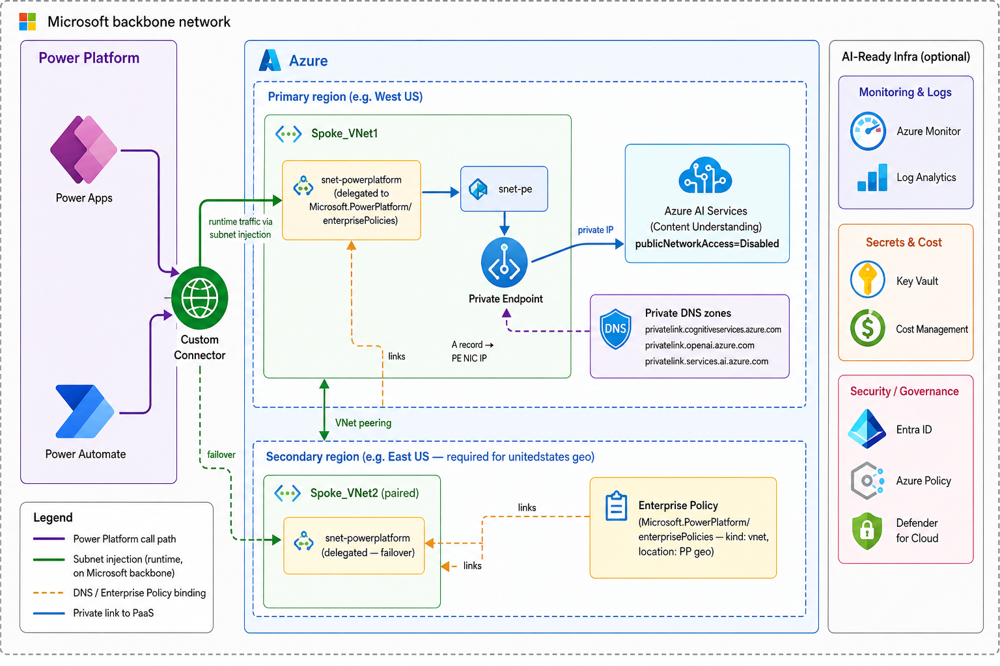
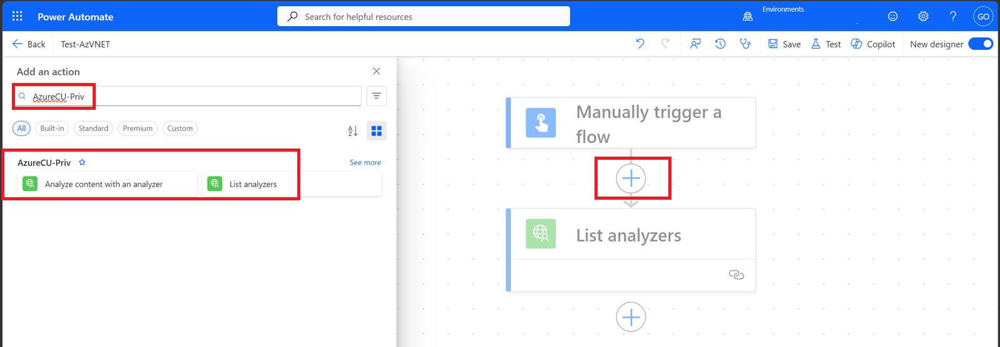
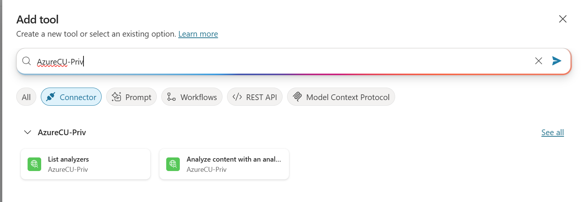
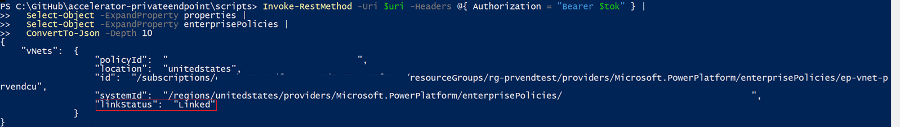

# Azure Content Server (Content Understanding) behind Private Endpoint + Power Platform

## Objective

Provide an end-to-end accelerator for hosting **Azure AI Content Understanding**
behind a **Private Endpoint** (no public network access) and consuming it from
a **Power Platform** Managed Environment via [Enterprise Policy / VNet
injection](https://learn.microsoft.com/power-platform/admin/vnet-support-setup-configure?tabs=existing%2Csingle&pivots=powershell#setup-with-powershell).

> Azure AI Services lets you set `publicNetworkAccess=Disabled`, but Power
> Platform is **not** a "trusted Microsoft service" for Cognitive Services —
> `bypass=AzureServices` alone won't let Power Platform reach a private-endpoint-locked
> account. A Power Platform Enterprise Policy linked to a delegated subnet is
> the supported way to bridge that gap.

What you get when you finish the steps below:

* `Microsoft.CognitiveServices/accounts` (kind `AIServices`) with `publicNetworkAccess=Disabled`, custom subdomain, and a Private Endpoint into a dedicated subnet.
* Three Private DNS zones linked to the primary VNet:
  `privatelink.cognitiveservices.azure.com`, `privatelink.openai.azure.com`,
  `privatelink.services.ai.azure.com`.
* Two delegated subnets in paired Azure regions for Power Platform VNet injection (multi-region PP geos like `unitedstates` require subnets in two regions).
* `Microsoft.PowerPlatform/enterprisePolicies` (kind `vnet`) referencing both delegated subnets, linked to your Managed PP environment.
* A Power Platform custom connector for the Content Understanding REST API plus a connectivity test.

## Architecture



## Getting Started

### Video Walkthrough

> 🎥 *Coming soon.* A short walkthrough of one-click deployment, linking the
> Enterprise Policy, and validating connectivity from a Power Automate flow.
>
> Speaker script / transcript: [docs/video-walkthrough.md](docs/video-walkthrough.md).

### Prerequisites

| Requirement | Notes |
| --- | --- |
| [Azure subscription](https://azure.microsoft.com/free/) Owner / Contributor | RG, networking, AI Services, PE, DNS, Enterprise Policy |
| [Azure CLI](https://learn.microsoft.com/cli/azure/install-azure-cli) ≥ `2.50` | only required for the scripted path |
| [PowerShell 7+](https://learn.microsoft.com/powershell/scripting/install/installing-powershell) (`pwsh`) | for the helper scripts |
| [`pac` CLI](https://learn.microsoft.com/power-platform/developer/cli/introduction#install-microsoft-power-platform-cli) signed in to the target PP environment | `pac auth list` |
| [`Microsoft.PowerPlatform.EnterprisePolicies` PowerShell module](https://www.powershellgallery.com/packages/Microsoft.PowerPlatform.EnterprisePolicies) | auto-installed by `link-enterprise-policy.ps1` |
| [Power Platform / Global Administrator](https://learn.microsoft.com/power-platform/admin/use-service-admin-role-manage-tenant) | required to enable Managed Environment + link the policy |
| Target environment is a [**Managed Environment**](https://learn.microsoft.com/power-platform/admin/managed-environment-overview) | Sandbox is not allowed; enable in PPAC |

### Deployment

#### Step 1 — Clone the repository

All scripts and the `.env.example` file live under
`accelerators/private-endpoint/content-server/`. Clone the repo and `cd` into that folder
before running any of the steps below.

```powershell
git clone https://github.com/gokseloral/Copilot-Studio-and-Azure.git
cd Copilot-Studio-and-Azure/accelerators/private-endpoint/content-server
```

#### Step 2 — Copy `.env.example` to `.env` and fill in your values

Both deployment paths read defaults from `.env` (the scripted path requires it;
the ARM path uses it as a convenient place to store your `ResourceGroup`,
`PowerPlatformEnvId`, etc. for the follow-up linking and connector scripts).

```powershell
Copy-Item .env.example .env
# then edit .env in your editor
```

Update at minimum:

| Variable | What to put here |
| --- | --- |
| `AZURE_SUBSCRIPTION_ID` | GUID of the Azure subscription you'll deploy into |
| `AZURE_RESOURCE_GROUP`  | Resource group name (created if it doesn't exist) |
| `AZURE_LOCATION`        | Primary Azure region — must match the primary region for your chosen `PP_GEO` (see the region-mapping table below) |
| `AZURE_SECONDARY_LOCATION` | Paired secondary Azure region for the second PP-delegated subnet (leave blank for `singapore` / `sweden`) |
| `BASE_NAME`             | 3–11 chars, lowercase alphanumerics; used to derive resource names |
| `PP_TENANT_ID`          | Microsoft Entra tenant ID hosting the PP environment |
| `PP_ENVIRONMENT_ID`     | Power Platform environment GUID (PPAC → Environments → your env → *Environment ID*, or `pac admin list`). NOT the org URL. |
| `PP_GEO`                | Power Platform region (e.g. `unitedstates`, `europe`, `unitedkingdom`, `japan`, `australia`, `asia`, `singapore`, `sweden`) |
| `ENTERPRISE_POLICY_NAME` | Name to give the `Microsoft.PowerPlatform/enterprisePolicies` resource |

`.env` is gitignored; `.env.example` is the only file checked in.

#### Step 3 — Provision the infrastructure

You have two options to provision the azure infrastructure. Pick **one** of them, then continue with the linking step.

#### Option A — One-click ARM deploy (recommended)

[](https://portal.azure.com/#create/Microsoft.Template/uri/https%3A%2F%2Fraw.githubusercontent.com%2Fgokseloral%2FCopilot-Studio-and-Azure%2Fmain%2Faccelerators%2Fprivate-endpoint%2Fcontent-server%2Finfra%2Fazuredeploy.json)
[](http://armviz.io/#/?load=https%3A%2F%2Fraw.githubusercontent.com%2Fgokseloral%2FCopilot-Studio-and-Azure%2Fmain%2Faccelerators%2Fprivate-endpoint%2Fcontent-server%2Finfra%2Fazuredeploy.json)

The portal blade collects:

| Parameter | Description | Example |
| --- | --- | --- |
| `baseName` | 3–11 chars, lowercase alphanumerics, used to derive resource names | `prvendcu` |
| `powerPlatformRegion` | Power Platform region. Drives the primary Azure region (Content Understanding-supported), the paired secondary Azure region, and the Enterprise Policy `location`. Only PP regions where at least one paired Azure region supports Content Understanding are listed. | `unitedstates`, `europe`, `unitedkingdom`, `japan`, `australia`, `asia`, `singapore`, `sweden` |
| `powerPlatformEnvironmentId` | GUID of the target PP environment (NOT the org URL) | `00000000-0000-0000-0000-000000000000` |
| `vnetAddressPrefix` / `peSubnetPrefix` / `ppSubnetPrefix` | Primary VNet + subnet CIDRs | `10.50.0.0/16` / `10.50.1.0/24` / `10.50.2.0/24` |
| `secondaryVnetAddressPrefix` / `secondaryPpSubnetPrefix` | Secondary VNet + delegated subnet CIDRs (must NOT overlap primary). Ignored for single-region PP geos (`singapore`, `sweden`). | `10.51.0.0/16` / `10.51.2.0/24` |
| `enterprisePolicyName` | Name of the `Microsoft.PowerPlatform/enterprisePolicies` resource | `ep-vnet-prvendcu` |

Tenant ID, subscription ID, and the signed-in identity come from the portal
session — you don't need to enter them.

**Region mapping reference.** The template derives the Azure regions and the PP geo string from `powerPlatformRegion` using the table below. PP regions that have **no** Content Understanding-supported Azure region (South Africa, India, France, Germany, Switzerland, Canada, Brazil, UAE, Korea, Norway, Italy, US Government) are **not** listed because Content Understanding cannot be provisioned there. See [PP supported regions](https://learn.microsoft.com/power-platform/admin/vnet-support-overview#supported-regions) and [Content Understanding region support](https://learn.microsoft.com/azure/ai-services/content-understanding/language-region-support#region-support).

| `powerPlatformRegion` | Primary Azure region (CU) | Secondary Azure region | Enterprise Policy `location` (PP geo) |
| --- | --- | --- | --- |
| `unitedstates`  | `westus`        | `eastus`             | `unitedstates`  |
| `europe`        | `westeurope`    | `northeurope`        | `europe`        |
| `unitedkingdom` | `uksouth`       | `ukwest`             | `unitedkingdom` |
| `japan`         | `japaneast`     | `japanwest`          | `japan`         |
| `australia`     | `australiaeast` | `australiasoutheast` | `australia`     |
| `asia`          | `southeastasia` | `eastasia`           | `asia`          |
| `singapore`     | `southeastasia` | *(none — single-region geo)* | `singapore` |
| `sweden`        | `swedencentral` | *(none — single-region geo)* | `sweden`    |

> For `singapore` and `sweden` the template skips the secondary VNet entirely; the Enterprise Policy is created with one delegated subnet only.

#### Option B — Scripted (`.env` + PowerShell)

```powershell
# Provision Azure infra + Enterprise Policy using values from .env
./scripts/deploy.ps1
```

#### Final step — link the Enterprise Policy to your PP environment

The ARM template (and the scripted path) stops at provisioning. Linking the
policy to the Power Platform environment requires Power Platform admin auth
that ARM cannot perform, so it runs locally.

**If you deployed via the one-click ARM template** (no `.env`):

```powershell
./scripts/link-enterprise-policy.ps1 `
    -ResourceGroup       <your-rg-name> `
    -PowerPlatformEnvId  <pp-environment-guid> `
    -UseDeviceCode
```

The script discovers the Enterprise Policy ARM ID from the resource group and
resolves the tenant from your `az login` context.

**If you deployed via the scripted (`.env`) path**:

```powershell
# .env already has PP_ENVIRONMENT_ID and PP_TENANT_ID set
./scripts/link-enterprise-policy.ps1 -UseDeviceCode
```

To unlink later (e.g. before changing the policy's subnets):

```powershell
./scripts/link-enterprise-policy.ps1 -Unlink -PowerPlatformEnvId <pp-environment-guid>
```

## Testing

### 1. Sign `pac` in to the target Power Platform environment

The custom-connector push uses `pac connector create`, which needs an
authenticated `pac` profile pointing at the environment you want the connector
created in.

```powershell
pac auth create --environment <environmentName>
```

`<environmentName>` can be the environment display name, the GUID, or the org
URL. Verify with `pac auth list` — the `*` marker should be on the row for the
target environment.

### 2. Push the custom connector + run the connectivity check

```powershell
./scripts/create-and-test-connector.ps1 -ResourceGroup <your-rg-name>
```

The script resolves the deployed AI Services account from the resource group
(or from `scripts/deployment-outputs.json` if you used the scripted path),
patches the swagger `host`, pushes the connector via `pac`, and then calls
`GET /contentunderstanding/analyzers?api-version=<preview>` directly against
the AI Services endpoint:

| Run from | Expected | Meaning |
| --- | --- | --- |
| Your laptop (public internet) | `403 Public access is disabled` | ✅ lockdown is working |
| VM inside `snet-pe` (use `-InsideVnetTest`) | `200 OK` | ✅ private endpoint + DNS working |
| Power Automate flow in linked env | `200 OK` | ✅ end-to-end PP → PE working (validated in step 3) |

> The "Test operation" button in the **custom connector designer** routes
> through the connector authoring host (`*.azure-apihub.net`) and **does not
> use VNet injection**. Always validate from a real flow run (step 3).

### 3. End-to-end test from a Power Automate flow or Copilot Studio

#### Option A — Power Automate flow

1. In the linked PP environment, create a flow with an **Instant** trigger.
2. Add an action from the custom connector (e.g. **List Analyzers**).
3. Create a new connection — supply the Cognitive Services key as the API key.
4. Run the flow. A `200` response confirms Power Platform → delegated subnet → Private Endpoint → Azure AI Services is fully wired.



#### Option B — Copilot Studio

1. Open [Copilot Studio](https://copilotstudio.microsoft.com/) in the same linked Managed Environment.
2. Create or open an existing agent (copilot).
3. Go to **Tools** (left nav) → **+ Add a tool** → search for your Content Understanding custom connector name.
4. Select the **Analyze content with an analyzer** action and add it to the agent.
5. In the **Test your agent** pane, send a message that triggers the analyze action (e.g. _"Analyze this document"_ with relevant input).
6. The agent should invoke the connector action and return the analyzer result — confirming private connectivity works end-to-end from Copilot Studio through the VNet.



> **Note:** Copilot Studio uses the same VNet injection path as Power Automate
> when the environment is linked to an Enterprise Policy. If the flow test
> works but Copilot Studio does not, verify the connector is in a Dataverse
> solution visible to the agent's environment.

### Verify the Enterprise Policy link (optional)

```powershell
$envId = '<pp-environment-guid>'   # or use $env:PP_ENVIRONMENT_ID if you used the scripted path
$tok   = az account get-access-token --resource 'https://service.powerapps.com/' --query accessToken -o tsv
$uri   = "https://api.bap.microsoft.com/providers/Microsoft.BusinessAppPlatform/scopes/admin/environments/$envId" + '?api-version=2019-10-01&$expand=properties.enterprisePolicies'
$ppEnv = Invoke-RestMethod -Uri $uri -Headers @{ Authorization = "Bearer $tok" }

if (-not $ppEnv.properties.PSObject.Properties['enterprisePolicies']) {
  Write-Warning "No Enterprise Policy is linked to this environment. Run scripts/link-enterprise-policy.ps1 first."
} else {
  $ppEnv.properties.enterprisePolicies | ConvertTo-Json -Depth 10
}
```

Look for `"linkStatus": "Linked"` inside the `vNets` object — that confirms
the policy is bound to the environment. If the script prints the warning
instead, no policy is linked yet (and any Power Automate call will return
`403 Public access is disabled`); run the link step in section [Final step
— link the Enterprise Policy to your PP environment](#final-step--link-the-enterprise-policy-to-your-pp-environment) and retry.

### Troubleshooting

| Symptom | Likely cause / fix |
| --- | --- |
| Power Automate flow returns `403 Public access is disabled. Please configure private endpoint.` | The Enterprise Policy is **not linked** to the PP environment yet. Verify with the snippet above (the `enterprisePolicies` property will be missing on the env). Run `scripts/link-enterprise-policy.ps1 -ResourceGroup <rg> -PowerPlatformEnvId <env-guid> -UseDeviceCode`, then delete + recreate the connection in Power Apps and retry the flow. |
| `Select-Object : Property "enterprisePolicies" cannot be found.` | Same root cause as the row above — the env has no policy linked, so the API doesn't return the property. Use the hardened verify snippet above (it checks for the property before expanding it) and link the policy. |
| `404` from `enterprisePolicies/vnet/link` | Environment is not a Managed Environment yet. Enable it in PPAC, then re-run. |
| `Environment location 'unitedstates' does not match the enterprise policy location 'westus'` | The Enterprise Policy resource's `location` must be the PP geo (`unitedstates`), not an Azure region. The provided template handles this; redeploy if you set it manually. |
| `EnterprisePolicyUpdateNotAllowed` when redeploying the policy | Policy is currently linked to an environment. Run `link-enterprise-policy.ps1 -Unlink`, redeploy, then re-link. |
| Custom connector test from PP flow returns `403 ThrowExceptionDueToTrafficDenied` | Connection cached from before the policy link. Delete the connection (Power Apps → Connections), re-create it, retry. |
| Custom connector doesn't appear in flow designer's **Custom** tab | Add the connector to a Dataverse solution (`pac connector update --solution-unique-name <name>`), then refresh. |

### Cleanup

```powershell
./scripts/link-enterprise-policy.ps1 -Unlink
az group delete -n $env:AZURE_RESOURCE_GROUP --yes --no-wait
```

---

Sample code provided as-is, no warranty. Review and adapt for production use
(naming conventions, resource tags, RBAC, diagnostic settings, address-space
planning, etc.).

## Appendix

### Repository Layout

```
infra/
  deploy.bicep              # one-click unified template (source of azuredeploy.json)
  azuredeploy.json          # compiled ARM template used by the Deploy to Azure button
  main.bicep                # modular VNet + AI Services + PE + DNS template
  main.bicepparam           # default address spaces (no env-specific values)
  enterprise-policy.bicep   # Microsoft.PowerPlatform/enterprisePolicies (vnet)
powerplatform/
  contentunderstanding-connector.swagger.json   # OpenAPI 2.0 source
  apiProperties.json                            # connection params / branding
scripts/
  load-env.ps1                     # parses .env into env vars
  deploy.ps1                       # deploys infra/* using values from .env
  link-enterprise-policy.ps1       # Enable/Disable subnet injection on PP env
  create-and-test-connector.ps1    # pac connector create + connectivity test
.env.example                       # copy to .env and fill in
```
