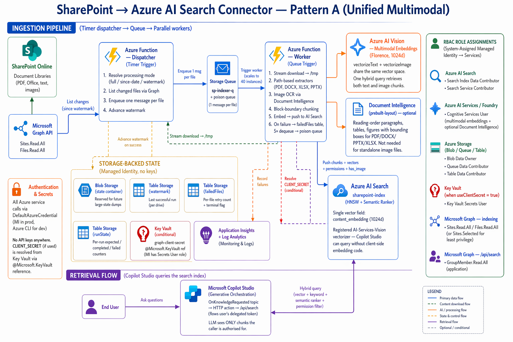

# SharePoint → Azure AI Search Connector

A production-oriented push connector that keeps an Azure AI Search index in sync with one (or a subset of) SharePoint site — so a Copilot Studio agent can ground its answers on up-to-date enterprise content while honouring each user's access rights.

## Table of Contents

- [Objective](#objective)
- [Features](#features)
- [Architecture Diagram](#architecture-diagram)
- [Getting Started](#getting-started)
  - [Video Walkthrough](#video-walkthrough)
  - [Prerequisites and Costs](#prerequisites-and-costs)
  - [Deployment Options](#deployment-options)
    - [Automated Deployment](#automated-deployment)
    - [Manual Deployment](#manual-deployment)
- [Key Requirements](#key-requirements)
- [Assumptions](#assumptions)
- [Testing the Solution](#testing-the-solution)
- [Project Structure](#project-structure)
- [How the Pipeline Works](#how-the-pipeline-works)
- [Customization Guide](#customization-guide)
  - [Addressing Well-Architected H/M Risks](#addressing-well-architected-hm-risks)
  - [Add a New File Format](#add-a-new-file-format)
  - [Change the Embedding Model](#change-the-embedding-model)
  - [Switch Between Processing Modes](#switch-between-processing-modes)
  - [Adjust Concurrency](#adjust-concurrency)
  - [Change the Search Index Schema](#change-the-search-index-schema)
- [Appendix — Useful Resources](#appendix--useful-resources)

---

## Objective

Ship a push-model SharePoint → Azure AI Search connector that a Copilot Studio agent can query **with true per-user security trimming**, over a **unified multimodal index** (text + image content in the same vector space), from a **well-defined subset** of a SharePoint site, with **deletion propagation**, **nightly backups**, and **least-privilege Graph access** — all running as a serverless Azure Function.

Azure AI Search's preview SharePoint connector has real limitations: no private endpoint support, no Conditional Access compatibility, no SLA, and limited control over the extraction pipeline. This accelerator is a worked example of how to build a custom push pipeline that gives you all of that control while still using the latest Azure services under the hood (Azure AI Vision multimodal embeddings, Document Intelligence Layout, Copilot Studio's built-in generative orchestration).

---

## Features

Use cases this accelerator is designed to enable:

1. **Grounded Copilot Studio agents over SharePoint content.** A generative-orchestration agent answers employee questions using the most recent SharePoint documents, with citations back to the source files.
2. **Per-user security trimming.** Only documents the signed-in user has SharePoint permission to see appear in the agent's retrievals and citations — enforced at retrieval time, not only in post-processing.
3. **Multimodal retrieval.** Text queries find images too. A question about "our Q3 revenue chart" surfaces the slide containing the chart, not just text that mentions Q3.
4. **Scoped monitoring.** Point the indexer at a specific site OR a specific folder within a site's library, so one connector instance watches one team's content without touching the rest of the tenant.
5. **Near-real-time deletion propagation.** When a file is deleted in SharePoint, its chunks leave the index on the next indexer run — no manual cleanup.

---

## Architecture Diagram



Editable source: [images/sharepoint-connector-architecture.drawio](images/sharepoint-connector-architecture.drawio) — open in [draw.io](https://app.diagrams.net) or the VS Code Draw.io extension, edit, then re-export to `sharepoint-connector-architecture.png` (same folder) to update the rendered image above.

**Flow at a glance.** The dispatcher (timer) asks SharePoint (via Graph `/delta`) what's changed, enqueues one message per file onto Storage Queue, and advances the per-drive delta token. Queue workers scale out: each pulls a message, streams the file to tempfile, routes through Document Intelligence Layout (if enabled) or the fallback extractors, parallelises chunk vectorisation through Azure AI Vision multimodal, uploads image crops to blob for citation thumbnails, and pushes the chunks (with `permission_ids`) into the AI Search index. A Copilot Studio agent in generative-orchestration mode runs an `OnKnowledgeRequested` topic that calls `/api/search` with the signed-in user's delegated token; the endpoint validates the JWT, resolves the user's group memberships through Graph with the Function's managed identity, applies a permission filter, and returns ranked citations.

---

## Getting Started

### Video Walkthrough

A ~15 minute end-to-end walkthrough — architecture, deployment, post-deployment configuration, and a smoke test against a real SharePoint site — script in [video-talk-script.md](video-talk-script.md). Recording coming soon; in the meantime, the script is complete enough to self-serve.

### Prerequisites and Costs

#### What you supply

| Prerequisite | Why it can't be auto-provisioned |
|---|---|
| A **SharePoint Online site** with the content you want indexed | It's your content; nobody else can create it. |
| An **Azure subscription** — Owner or User Access Administrator on the target RG | Template assigns RBAC on seven resources. |
| An Entra role that includes **`Application.ReadWrite.OwnedBy`** on Microsoft Graph — e.g. **Application Administrator** or **Cloud Application Administrator** | The template declares the `/api/search` app registration via the Microsoft Graph Bicep extension; it runs under the deployer's Graph token. |

That's it. The template creates the Entra app registration itself — no separate helper script, no `tenantId` to paste in (it's inferred from the deployment context).

#### Workstation tools

| Tool | Why |
|---|---|
| **[Azure CLI](https://learn.microsoft.com/cli/azure/install-azure-cli)** (`az`) | Bicep deployment + app-registration creation |
| **Bicep CLI** (bundled with recent `az`) | Template compilation |
| PowerShell 7+ | Runs `deploy.ps1` |

No local Python, `uv`, or `func` CLI needed — the function code is pulled from a GitHub Release by the deployment itself.

#### What the template creates

Storage Account (with queue / table / blob containers), Log Analytics + Application Insights, **Azure AI Search (Basic)**, **Microsoft Foundry / Azure AI Services** multi-service (hosts Azure AI Vision multimodal embeddings), **Document Intelligence** (Layout), **Key Vault**, Flex Consumption plan, and the Function App — plus every RBAC assignment on the Function's managed identity. No "pre-existing resource" paste-in.

#### Costs

Every resource below bills independently — click through for the official, up-to-date rates for your region. The shape of the bill is **mostly fixed per month from AI Search + Key Vault + Storage overhead, plus per-call consumption on the AI services during ingestion and query**.

| Resource | Pricing |
|---|---|
| Azure AI Search | [Pricing](https://azure.microsoft.com/pricing/details/search/) |
| Azure AI Services — Vision multimodal embeddings | [Pricing](https://azure.microsoft.com/pricing/details/cognitive-services/computer-vision/) |
| Azure AI Document Intelligence | [Pricing](https://azure.microsoft.com/pricing/details/ai-document-intelligence/) |
| Azure Functions (Flex Consumption) | [Pricing](https://azure.microsoft.com/pricing/details/functions/) |
| Azure Storage | [Pricing](https://azure.microsoft.com/pricing/details/storage/blobs/) |
| Azure Key Vault | [Pricing](https://azure.microsoft.com/pricing/details/key-vault/) |
| Azure Monitor (Application Insights + Log Analytics) | [Pricing](https://azure.microsoft.com/pricing/details/monitor/) |
| Azure Managed Identity | [Pricing](https://azure.microsoft.com/pricing/details/active-directory/) (included with Entra tenant) |

> Need an overall estimate? Plug the resource SKUs into the [Azure pricing calculator](https://azure.microsoft.com/pricing/calculator/).

### Deployment Options

The template asks for **two values** — everything else is inferred, defaulted, or created by the deployment itself.

| Parameter | Required? | What it is |
|---|---|---|
| `baseName` | ✅ | Resource-name prefix (3–16 chars). A uniqueness hash is appended for globally-unique resources. |
| `sharePointSiteUrl` | ✅ | Full URL of the SharePoint site to monitor. |
| `location` | optional | Azure region (default `resourceGroup().location`). Pick one that supports Azure AI Vision multimodal 4.0. |

Handled by the template itself:

- **Tenant ID** comes from the deployment context (`subscription().tenantId`).
- **`apiAudience`** — the template declares the `/api/search` Entra app registration via the Microsoft Graph Bicep extension, exposes the `access_as_user` delegated scope, and declares `GroupMember.Read.All` (Application) in the required-resource-access manifest. Admin consent on that Graph permission remains a post-deploy step (see below). The resulting client ID is emitted as the `apiAudience` deployment output.
- **Function-app package URL** is hardcoded to the latest GitHub Release (`sharepoint-connector-latest`); edit `main.bicep` directly if you want to point at a fork.

#### Automated Deployment

[](https://portal.azure.com/#create/Microsoft.Template/uri/https%3A%2F%2Fraw.githubusercontent.com%2FAzure%2FCopilot-Studio-and-Azure%2Fmain%2Faccelerators%2Fsharepoint-connector%2Fdeploy%2Fazuredeploy.json)

Clicking the button opens the Azure portal's custom-deployment form pre-populated with the five parameters above. The template provisions **everything** — Storage Account (+ queue / table / containers), Log Analytics + App Insights, Azure AI Search (Basic), Microsoft Foundry / Azure AI Services multi-service (hosts Vision multimodal), Document Intelligence (Layout), Key Vault, Flex Consumption plan + Function App, and every RBAC assignment on the Function's managed identity. It also **pulls the latest CI-built function-app package** from GitHub Releases (`sharepoint-connector-latest`) via an ARM `deploymentScript` and writes it to the Function App's storage container — so the code is already running when the deployment finishes. No `func publish` step.

After the ARM deployment succeeds, three manual steps remain — each requires Entra / SharePoint / Power Platform roles that Azure RG Owners typically don't hold, which is why they stay out of the one-click flow:

1. **Grant Sites.Selected on the target site** (least privilege — *strongly recommended*). Requires SharePoint Administrator or Global Administrator:
   ```powershell
   .\infra\grant-site-permission.ps1 `
       -SiteUrl "https://contoso.sharepoint.com/sites/YourSite" `
       -FunctionAppName "<function-app-name>"
   ```
2. **Grant `GroupMember.Read.All` (Application)** Graph permission to the managed identity so `/api/search` can resolve transitive group memberships. Requires Global Administrator or Cloud Application Administrator.
3. **Import the Copilot Studio topic** [`copilot-studio-topics/OnKnowledgeRequested.yaml`](copilot-studio-topics/OnKnowledgeRequested.yaml) into your generative-orchestration agent, fill in the two placeholders (Function App hostname + OAuth2 connection reference), and publish. Requires the Copilot Studio environment maker role.

Then wait 2–10 minutes for RBAC propagation and let the timer fire — or trigger manually.

#### Manual Deployment

Preferred when you need to review or customise each step.

1. **Clone the repo** (no local Python setup needed — the function code is pulled from a GitHub Release at deploy time):
   ```bash
   git clone <repo-url>
   cd accelerators/sharepoint-connector
   ```
2. **Copy the sample parameter file**, then fill in the five required values:
   ```powershell
   Copy-Item infra/main.bicepparam.sample infra/main.bicepparam
   # Edit infra/main.bicepparam with your baseName, tenantId,
   # sharePointSiteUrl, and apiAudience.
   ```
3. **Run the deploy script** — creates the RG if needed, runs the Bicep, and seeds the function-app package from `sharepoint-connector-latest` automatically:
   ```powershell
   .\infra\deploy.ps1 -ResourceGroup my-rg
   ```
4. **Grant Sites.Selected** on your target site (see Automated Deployment step 1).
5. **Grant `GroupMember.Read.All` (Application)** on Graph to the managed identity (see Automated Deployment step 2).
6. **Import the Copilot Studio topic** (see Automated Deployment step 3).

**Fork / custom-code users** — the template pulls from `github.com/Azure/Copilot-Studio-and-Azure/releases/download/sharepoint-connector-latest/sharepoint-connector.zip` by default. If you're deploying from a fork with code changes, either:

- Let the `Release SharePoint Connector` GitHub Actions workflow in your fork run (it republishes the `sharepoint-connector-latest` tag in your fork, and you point `packageReleaseUrl` at your fork), OR
- Publish the zip to any public URL and pass `packageReleaseUrl=<your-url>` as a Bicep parameter override.

**Pushing new code after the initial deploy** — merge to `main`, wait for the `Release SharePoint Connector` Action to republish `sharepoint-connector-latest`, then restart the Function App so it re-pulls from blob:

```powershell
az functionapp restart --name <function-app-name> --resource-group <rg>
```

(Or configure an Event-Grid-triggered redeploy — out of scope for the accelerator.)

#### Post-deployment tuning (no redeploy needed)

Every operational knob lives as an **app setting** on the Function App — change one via `az functionapp config appsettings set` and the next dispatcher / worker run picks it up. Common adjustments:

| Setting | Default | When to change |
|---|---|---|
| `SHAREPOINT_LIBRARIES` | *(all)* | Restrict to specific document-library display names. |
| `SHAREPOINT_ROOT_PATHS` | *(whole library)* | Restrict to folders inside a library. |
| `PROCESSING_MODE` | `since-last-run` | `full` for cleanup; `since-date` + `START_DATE` for historical backfills. |
| `VECTORISE_CONCURRENCY` / `MULTIMODAL_MAX_IN_FLIGHT` | `8` / `8` | Raise for faster initial bulk loads (subject to Vision TPS). |
| `BACKUP_SCHEDULE` / `BACKUP_RETENTION_DAYS` | `0 0 3 * * *` / `7` | Adjust nightly backup cadence + retention. |
| `FORCE_RECREATE_INDEX` | `false` | Set `true` **once** after a breaking index-schema change, then flip back. |

See the **[Customization Guide](#customization-guide)** for the complete list + recipes.

---

## Key Requirements

The concrete requirements this accelerator was designed to meet, and how each is implemented.

| # | Requirement | How it's met |
|---|---|---|
| 1 | Process all files OR since a configured date OR since last successful run | `PROCESSING_MODE` env var: `full` / `since-date` / `since-last-run` (default) with persistent watermark + delta tokens. |
| 2 | Scale past 50 files per run | Queue-fed fan-out: timer dispatcher enqueues one message per file; queue-triggered workers scale to 40 instances. |
| 3 | Multimodal RAG for text- and image-heavy documents | Azure AI Vision multimodal embeddings (1024d, same space for text + images); optional Document Intelligence Layout for structural extraction. |
| 4 | Semantic indexing | Azure AI Search `semanticConfiguration` with HNSW vector + hybrid query. |
| 5 | Large files >200 MB | Streaming download to tempfile; path-based extractors (PyMuPDF, python-docx/pptx, openpyxl read-only); default cap 500 MB. |
| 6 | Scope to one site / folder / library | `SHAREPOINT_SITE_URL` + `SHAREPOINT_LIBRARIES` + `SHAREPOINT_ROOT_PATHS`. |
| 7 | Least-privilege Graph access | `Sites.Selected` + per-site grant via `infra/grant-site-permission.ps1`. |
| 8 | Managed identity + Key Vault | Every Azure call uses DefaultAzureCredential; CLIENT_SECRET (if used) is a `@Microsoft.KeyVault(...)` reference. |
| 9 | Cite only files the user has access to | `/api/search` endpoint validates Entra JWT, resolves transitive groups, applies `permission_ids/any(...)` filter; wired into Copilot Studio via the `OnKnowledgeRequested` topic. |
| 10 | Handle deletions at source | Graph `/delta` query captures deletions; index chunks are removed on the next run. Periodic full reconciliation (default: every 24 runs) as belt + braces. |
| 11 | Backup the index | Nightly timer function exports schema + documents (metadata) + state tables to the `backup` container with configurable retention. |
| 12 | Throughput under rate limits | Per-file chunk vectorisation runs on a bounded thread pool; the Vision client holds a global semaphore and a shared 429 cool-off so all workers back off together. |

---

## Assumptions

Areas the Well-Architected assessment flagged as open. This accelerator ships a production-*oriented* sample — the following are **deliberately out of scope** and left for customer-specific implementation.

| Area | Current behaviour | What to do if you need it |
|---|---|---|
| **Network isolation** | All services on public endpoints (RBAC + HTTPS). | Layer private endpoints for Storage, Search, Foundry, Function App, Key Vault; enable VNet integration on the Function plan. |
| **Customer-managed keys (CMK)** | Relies on Microsoft-managed keys. | Swap in CMK via Bicep parameters for compliance scenarios. |
| **Multi-region DR** | Single-region deployment; no failover. | Pair-region active/passive with Traffic Manager / Front Door routing. |
| **Cost budgets + alerts** | No `Microsoft.Consumption/budgets` resource. | Add a budget at RG level with email alerts at 50 / 80 / 100 %. |
| **Alert rules / operational dashboard** | App Insights ingests, but no `scheduledQueryRules` or Workbooks. | Add three alerts: dispatcher exception, >10 % `files_skipped_error`, no successful run in 3× schedule. Commit a Workbook to `monitoring/workbook.json`. |
| **CI/CD pipeline** | Imperative deploy (`deploy.ps1` + `func publish`). | Add a GitHub Actions workflow with OIDC-federated deploy; dev + gated prod stages. |
| **Sensitivity labels** | Microsoft Purview labels not read, stored, or enforced. | Add `informationProtectionLabel` to Graph `$select`, index it, enforce via `BLOCKED_LABELS`. |
| **SharePoint-only groups** | `permission_ids` holds Entra object IDs only. Access granted exclusively through SharePoint site-collection groups (Members / Visitors / Owners) won't match at query time. | Map SharePoint groups to Entra groups, or add the Entra equivalents to `ALWAYS_ALLOWED_IDS`. |
| **Anonymous / org-wide sharing links** | Not represented in `permission_ids`. | Add the tenant's "all authenticated users" object ID to `ALWAYS_ALLOWED_IDS`. |
| **Permission freshness at query time** | Permissions are a snapshot from indexing time. | Re-index a file to reflect revocations. Group-membership changes ARE picked up at query time (5-min cache). |

---

## Testing the Solution

### Sample test data

If you don't have representative SharePoint content yet, Microsoft publishes a public corpus you can upload to your test site to exercise the pipeline end-to-end:

- **[Azure-Samples / azure-search-sample-data](https://github.com/Azure-Samples/azure-search-sample-data)** — mixed PDFs, DOCX, HTML, JSON, and image files covering real retrieval scenarios (healthcare PDFs, financial reports, hotel descriptions, NASA earth-at-night imagery, etc.). Drop any of these folders into the SharePoint document library the connector is pointing at and they'll flow through the full pipeline (text extraction, image OCR / embedding via Azure AI Vision multimodal, permission-filtered retrieval).

Recommended starter set for a quick smoke test:

| Folder in the repo | Why it's useful here |
|---|---|
| `health-plan/` | Small set of short PDFs — fast to ingest, exercises Document Intelligence Layout. |
| `hotel-reviews-images/` | Standalone JPGs — exercises Azure AI Vision multimodal (`vectorizeImage`) and the `content_path` / image-citation flow. |
| `nasa-e-book/` | Large-ish PDF with embedded figures — exercises Layout's figure extraction + neighbour-text chunking. |
| `hotels/` | JSON/HTML — exercises the plain-text path (extractors that bypass DocIntel). |

Upload via the SharePoint UI or [Add-PnPFile](https://pnp.github.io/powershell/cmdlets/Add-PnPFile.html) / `m365 spo file add` for scripted ingestion.

### 1. Trigger a one-off run

```powershell
$masterKey = (az functionapp keys list --name <function-app-name> --resource-group <rg> --query "masterKey" -o tsv)
Invoke-WebRequest -Uri "https://<function-app-name>.azurewebsites.net/admin/functions/sp_indexer_timer" `
    -Method POST `
    -Headers @{"x-functions-key"=$masterKey; "Content-Type"="application/json"} `
    -Body '{}'
```

Watch logs:

```bash
func azure functionapp logstream <function-app-name>
```

You should see the dispatcher log delta-query output, enqueue messages, and workers process them in parallel.

### 2. Confirm documents landed in the index

```powershell
$token = (az account get-access-token --resource "https://search.azure.com" | ConvertFrom-Json).accessToken
Invoke-RestMethod -Uri "https://<search>.search.windows.net/indexes/sharepoint-index/docs?api-version=2024-07-01&search=*&`$count=true&`$top=0" `
    -Headers @{"Authorization"="Bearer $token"}
```

Expect `@odata.count > 0`.

### 3. Test `/api/search` directly with a user token

```bash
TOKEN=$(az account get-access-token --resource api://<api-client-id> --query accessToken -o tsv)

curl -X POST "https://<function-app-name>.azurewebsites.net/api/search" \
  -H "Authorization: Bearer $TOKEN" \
  -H "Content-Type: application/json" \
  -d '{"query": "quarterly results", "top": 5}'
```

### 4. Verify deletion propagation

1. Delete a file in SharePoint (one that you've confirmed is indexed).
2. Trigger the dispatcher manually (or wait for the next schedule).
3. Run the `/indexes/.../docs/search` query from step 3 and confirm the deleted file's citations have disappeared.

### 5. Verify per-user trimming

Run step 3 as **two different users**: one with SharePoint access to a specific file, one without. The second user should receive zero citations for that file, even when searching for terms that only appear in it.

### 6. Trigger a backup on demand

```powershell
$functionKey = (az functionapp keys list --name <function-app-name> --resource-group <rg> --query "functionKeys.default" -o tsv)
Invoke-WebRequest -Uri "https://<function-app-name>.azurewebsites.net/api/backup?code=$functionKey" -Method POST
```

Check the `backup` container in the storage account — you should see a `YYYY-MM-DD/` folder with `index-schema.json`, `documents.jsonl`, `watermarks.jsonl`, and `failed-files.jsonl`.

### 7. Run the unit tests locally

```bash
uv sync --extra dev
uv run pytest tests/ -v
```

The suite covers config loading, all extractors (PDF / DOCX / PPTX / XLSX / plain-text), block-aware chunking, DocIntel-result-to-block mapping, the multimodal embeddings client (including the bounded-concurrency and 429 cool-off paths), the security-filter builder, and processing-mode resolution.

---

## Project Structure

```text
sharepoint-connector/
│
│── function_app.py                   # Azure Functions entry points:
│                                     #   sp_indexer_timer   — dispatcher (timer)
│                                     #   sp_worker          — queue-triggered worker
│                                     #   sp_poison_handler  — terminal failures
│                                     #   sp_search          — /api/search (HTTP)
│                                     #   sp_backup_timer    — nightly backup
│                                     #   sp_backup_manual   — POST /api/backup
│
│── indexer.py                        # Main orchestrator (per-file pipeline)
│── config.py                         # Env-var → dataclass loader
│── sharepoint_client.py              # Microsoft Graph client (list, download,
│                                     #   permissions, /delta query)
│── document_processor.py             # extract_text + extract_blocks routing
│── doc_intelligence_client.py        # Document Intelligence Layout wrapper
│── multimodal_embeddings_client.py   # Azure AI Vision vectorize{Text,Image}
│                                     # + bounded-concurrency semaphore + 429
│                                     #   cool-off
│── chunker.py                        # chunk_text / chunk_blocks
│── blocks.py                         # Block + LocationMetadata dataclasses
│── search_client.py                  # AI Search schema + ensure_index +
│                                     #   search_with_trimming (permission filter)
│── search_security.py                # JWT validation, Graph group resolution,
│                                     #   OData filter builder
│── image_storage.py                  # Upload image crops to blob for citations
│── state_store.py                    # Table + queue abstractions:
│                                     #   watermarks, delta tokens, failed files,
│                                     #   run state, run counter
│── index_backup.py                   # Nightly schema + docs + state export
│── embeddings_client.py              # (legacy stub — unused in Pattern A)
│
│── host.json                         # Functions runtime + queue tuning
│── pyproject.toml                    # uv / pip deps
│── requirements.txt                  # Pinned deps for Functions publish
│── .env.sample                       # Env-var reference (copy → .env)
│── .funcignore                       # Deploy-package exclusions
│── .gitignore                        # Includes infra/main.bicepparam
│
├── infra/
│   ├── main.bicep                    # Full IaC: Function App + Storage
│   │                                 #   (queue/table/state/images/backup) +
│   │                                 #   App Insights + optional Key Vault +
│   │                                 #   optional Document Intelligence + RBAC
│   ├── main.bicepparam               # Live parameters (gitignored)
│   ├── main.bicepparam.sample        # Committed template
│   ├── deploy.ps1                    # One-command deploy
│   └── grant-site-permission.ps1     # Sites.Selected least-privilege grant
│
├── copilot-studio-topics/
│   └── OnKnowledgeRequested.yaml     # Topic YAML — import into a generative-
│                                     # orchestration agent to wire /api/search
│                                     # in as the knowledge source
│
├── deploy/
│   └── azuredeploy.json              # ARM (generated from main.bicep)
│
├── images/
│   └── sharepoint-connector-architecture.drawio
│
└── tests/                            # 113 pytest cases covering:
    ├── test_chunker.py               #   chunk_text boundaries
    ├── test_chunk_blocks.py          #   chunk_blocks + neighbour-text
    ├── test_config.py                #   env-var resolution
    ├── test_doc_intelligence.py      #   Layout-result → Block mapping
    ├── test_document_processor.py    #   all extractors
    ├── test_multimodal_client.py     #   vectorize + 429 + semaphore bound
    ├── test_processing_modes.py      #   full / since-date / since-last-run
    └── test_search_security.py       #   JWT + filter + identity cache
```

---

## How the Pipeline Works

Each scheduled run follows these steps.

### Ingestion — dispatcher

1. **Timer fires.** `sp_indexer_timer` runs on `INDEXER_SCHEDULE` (default: every hour).
2. **Mode resolution.** `_resolve_modified_since(config, now)` picks the cutoff:
   - `full` → no filter (full reindex + reconciliation).
   - `since-date` → absolute `START_DATE` from config.
   - `since-last-run` (default) → reads the per-drive **delta token** from `state_store`. First run with no token → process everything.
3. **Change discovery.** `SharePointClient.list_changes_all_drives(delta_tokens, extensions)` calls `/drives/{id}/root/delta` on each target drive (filtered by `SHAREPOINT_LIBRARIES`). Returns *modified* items, *deleted* item IDs, and *new* delta tokens.
4. **Folder scoping.** If `SHAREPOINT_ROOT_PATHS` is set, modified items whose parent path doesn't match any configured root are dropped client-side.
5. **Deletion propagation.** For every deleted item ID, `_delete_chunks_for_items` computes the `parent_id` across every target drive and calls `search.delete_documents_by_parent(...)`. Stale index chunks leave the index immediately.
6. **Enqueue.** Each remaining item becomes one queue message on `sp-indexer-q` (carrying `drive_id`, `item_id`, `size`, `web_url`, …).
7. **State persistence.** The per-drive delta tokens + run timestamp are written. The global run counter increments; every `RECONCILE_EVERY_N_RUNS` runs triggers a full-index reconciliation pass.

### Ingestion — worker (one per queue message)

1. **Dequeue.** `sp_worker` is a queue-triggered function. Functions runtime auto-scales to `host.json` `batchSize` × up-to-40 instances.
2. **Poison protection.** `state_store.get_failure_count(item_id)` skips items that have already failed ≥5 times (message flows on to `sp-indexer-q-poison`).
3. **Stream download.** `SharePointClient.download_file_to_path(...)` streams bytes from Graph to a tempfile — memory stays bounded no matter the file size.
4. **Fetch permissions.** `get_item_permissions` returns the Entra object IDs that have access (from `grantedToV2` + `grantedToIdentitiesV2`). These become the chunk's `permission_ids`.
5. **Extract blocks.** `extract_blocks(path, name, doc_intel=...)` routes:
   - Standalone image files → one `IMAGE` block with raw bytes.
   - PDF / DOCX / PPTX / XLSX with DocIntel enabled → `prebuilt-layout` → paragraph + table + figure blocks with bounding polygons.
   - Everything else → hand-written extractor → one `TEXT` block per file.
6. **Chunk.** `chunk_blocks(blocks, doc_id, chunk_size, chunk_overlap)`:
   - Text blocks are concatenated and split with overlap at paragraph / sentence boundaries.
   - Image blocks become their own chunk with the immediately preceding + following paragraphs attached as `neighbour_text`.
7. **Vectorise in parallel.** Every chunk goes through the same multimodal endpoint, up to `VECTORISE_CONCURRENCY` at once per worker. The `MultimodalEmbeddingsClient` enforces the global ceiling (`MULTIMODAL_MAX_IN_FLIGHT`) and a shared 429 cool-off so concurrent workers back off together.
8. **Store image crops.** For each image chunk, `ImageStore.upload_image(...)` pushes the cropped bytes into the `images` blob container and stamps `content_path` on the chunk.
9. **Delete old chunks for this parent.** `search.delete_documents_by_parent(parent_id)` clears any prior version.
10. **Push.** A single `search.upload_documents(docs)` writes every chunk (text + image) of the file to the index in one batch.
11. **State.** Success clears the failed-files record; failure increments it (and eventually poisons the message).

### Retrieval — `/api/search` (called from Copilot Studio)

1. **Request arrives.** Copilot Studio's `OnKnowledgeRequested` topic posts `{ query, top }` with the signed-in user's delegated Entra token in `Authorization`.
2. **JWT validation.** `validate_user_token(bearer, audience, tenant)` verifies signature (via Entra JWKS), audience, issuer, expiry. Extracts `oid` + `tid`.
3. **Identity resolution.** `GraphIdentityResolver.get_identity_ids(user_oid)` calls `/users/{oid}/transitiveMemberOf` using the Function's managed identity (`GroupMember.Read.All`) and returns `[user_oid, group_oid_1, group_oid_2, …]`. Cached in-process for `IDENTITY_CACHE_TTL_SECONDS` (default 5 min).
4. **Filter + hybrid query.** `SearchPushClient.search_with_trimming(...)` builds `permission_ids/any(p: p eq 'id1') or … or p eq 'idN'` and runs a semantic + vector query against `content_embedding`. The registered `aiServicesVision` vectorizer converts the query text into a 1024d vector server-side.
5. **Return citations.** Ranked list with `{ title, url, chunk, has_image, content_path, location_metadata, score, reranker_score }`. Copilot Studio uses these as grounded evidence.

---

## Customization Guide

### Addressing Well-Architected H/M Risks

Concrete playbooks for the high / medium severity items still open in the Well-Architected assessment after this iteration. 

| # | Risk | Pillar | Severity | How to address |
|---|---|---|---|---|
| S1 | Public endpoints on Storage, Search, Foundry, Function, Key Vault | Security | **H** | Enable VNet integration on the Flex plan; add `privateEndpoints` for Storage / Search / Foundry / Key Vault; set `publicNetworkAccess: 'Disabled'` with `networkAcls.defaultAction: 'Deny'` on those services. |
| O1 | No CI/CD pipeline | Ops | **H** | Ship `.github/workflows/deploy.yml`: lint + pytest + `bicep build` on PR; OIDC-federated `az deployment group create` + `func publish` on merge to `main`; gated promotion to prod via `environments`. |
| O3 | No alert rules provisioned | Ops | **H** | Add three `Microsoft.Insights/scheduledQueryRules` in Bicep: (a) dispatcher exception, (b) `files_skipped_error` > 10 %, (c) no successful run in 3× schedule. Route to an Action Group (email / Teams webhook). |
| R1 | Single region | Reliability | M | Stand up the same Bicep in a paired region; add a Traffic-Manager / Front Door profile for `/api/search` if you need active/passive. The index itself isn't replicated — use the nightly backup to rehydrate. |
| R5 | No health / liveness probe | Reliability | M | Add an HTTP-triggered `sp_health` function that HEAD-pings Search + Foundry + Graph (with MI) and returns 200 / 503. Hook it to an App Insights availability test. |
| R6 | No retry budget across downstream calls | Reliability | M | Track total backoff time in a `threading.local` timer inside each worker; abort with "retry budget exhausted" after e.g. 60 s cumulative sleep. |
| R9 | Multimodal endpoint is a single hard dependency | Reliability | M | Add a secondary Foundry endpoint in a different region; `MultimodalEmbeddingsClient` falls over to it when primary returns 5xx for N consecutive calls. |
| S3 | Function master key still emitted | Security | M | After the queue-mode migration settles, disable the master key and switch the `/api/backup` endpoint to Entra auth to match `/api/search`. |
| S5 | No Microsoft Defender | Security | M | Enable Defender for Storage + Defender for App Service at the subscription level. No Bicep work — subscription policy. |
| S6 | Data-retention / purge policy | Security | M | Add `MAX_STALE_DAYS` env var; the periodic reconciliation pass (already in place) deletes orphans older than that. |
| C1 | No budget / cost alerts | Cost | M | Add a single `Microsoft.Consumption/budgets` resource at RG scope with email alerts at 50 / 80 / 100 %. |
| C3 | Re-embedding on trivial metadata changes | Cost | M | Add a `content_hash` field; skip re-embedding when the hash matches even if `last_modified` bumped. |
| O4 | No operational dashboard | Ops | M | Commit a Workbook JSON under `monitoring/workbook.json` and provision it in Bicep. Show run frequency, p50/p95 per-file time, top error types, embedding-call counts. |
| O5 | No distributed tracing | Ops | M | Set `OTEL_PYTHON_LOG_CORRELATION=true` + `APPLICATIONINSIGHTS_CONNECTION_STRING`; the Azure SDKs auto-instrument against OpenTelemetry. |
| O6 | No runbooks | Ops | M | Create `docs/runbooks/` with short playbooks for Graph throttling, Vision quota exceeded, DocIntel outage, Search index corruption, Key Vault reference resolution failure. |
| O12 | Imperative `func publish` deploy | Ops | M | Replace with `Azure/functions-action@v1` in the CI/CD workflow from O1. |
| P2 | Freshness check is N serial queries | Performance | M | Batch the filter: one query per ~100 `parent_id`s using `parent_id eq 'A' or parent_id eq 'B' or …`. |
| P3 | Reconciliation pulls the full index | Performance | M | Paginate `search.get_all_parent_ids` with `skip` + `$top`, or cache parent IDs in a dedicated Table entity for O(1) enumeration. |
| P8 | No load testing / throughput SLO | Performance | M | Commit a k6 or Locust harness under `tests/load/` + document an SLO (e.g. "1 000 files in 10 minutes on FC1 4 GB"). |

### Add a New File Format

1. Add an extractor to [document_processor.py](document_processor.py):
   ```python
   def _extract_myformat(content: bytes | None, filename: str = "", *, path: str | None = None) -> str:
       # If the library supports a path, prefer it (bounded memory on large files).
       source = path if path is not None else io.BytesIO(content or b"")
       ...
       return extracted_text
   ```
2. Wire it into the `extractors` dict at the top of `extract_text()`:
   ```python
   ".myext": _extract_myformat,
   ```
3. If the extractor supports `path=`, add `.myext` to the `_path_aware` set below (preserves the large-file streaming guarantee).
4. Add `.myext` to [.env.sample](.env.sample) `INDEXED_EXTENSIONS` and to the Bicep `indexedExtensions` default so it's enabled by default for new deployments.
5. Add the new library dependency to [pyproject.toml](pyproject.toml) and regenerate `requirements.txt`.
6. Write a unit test under [tests/test_document_processor.py](tests/test_document_processor.py) with a synthetic fixture.

### Change the Embedding Model

The accelerator is built around Azure AI Vision multimodal (1024d). Swap paths:

- **Different Vision model version** → set `MULTIMODAL_MODEL_VERSION` (default `2023-04-15`). If the vector dimension changes, set `FORCE_RECREATE_INDEX=true` for ONE run, then flip back to false.
- **Different provider (e.g. Azure OpenAI text-embedding-3-large for text-only deployments)** →
  1. Rewrite [multimodal_embeddings_client.py](multimodal_embeddings_client.py) (or add a sibling `text_embeddings_client.py`) around the target REST API. Keep the semaphore + 429 cool-off pattern.
  2. Change `content_embedding` dimensions in `_build_index` in [search_client.py](search_client.py).
  3. Update the `Vectorizer` registered on the index — use `AzureOpenAIVectorizer` instead of `AIServicesVisionVectorizer`.
  4. Set `FORCE_RECREATE_INDEX=true` for one run.
  5. Image chunks will either need a separate vector field (dual-vector Pattern C) or will fall back to captions-as-text.
- **Different dimension on the same model** → only the Bicep `multimodalModelVersion` + the `_build_index` `dimensions` parameter change; everything else is already parametrised.

### Switch Between Processing Modes

**Indexer mode** (`PROCESSING_MODE`):

| Value | Behaviour | When to pick it |
|---|---|---|
| `since-last-run` (default) | Reads delta tokens per drive; processes adds/modifications + mirrors deletions. First run with no token processes everything. | Production default. |
| `since-date` | Processes files modified at/after `START_DATE` (ISO-8601 UTC). Ignores any stored watermark/tokens. | Bulk backfill from a fixed date. |
| `full` | Processes every file every run. Reconciliation cleans orphans every time. | Periodic cleanup; schema migration. |

Switch via `az functionapp config appsettings set --name <fn> --resource-group <rg> --settings PROCESSING_MODE=...`. Takes effect on the next dispatcher run.

**Function processing model** (`FUNCTION_PROCESSING_MODE`):

| Value | Behaviour | Trade-off |
|---|---|---|
| `queue` (default) | Dispatcher enqueues one message per file; queue-triggered workers scale horizontally (up to 40 instances). | Best for large sites. Slight operational complexity (monitor queue depth). |
| `inline` | Single timer function does everything in one invocation. | Simpler to reason about. Bounded by one function's 30-min timeout — fine for <50 small files / run. |

### Adjust Concurrency

Three knobs, tuned independently:

| Setting | Scope | Default | Raise when… | Lower when… |
|---|---|---|---|---|
| `MAX_CONCURRENCY` | Per-dispatcher ThreadPool (only used in `inline` mode) | 4 | Using inline mode on small files | Memory pressure on 2 GB instances |
| `VECTORISE_CONCURRENCY` | Per-worker ThreadPool for chunk vectorisation | 8 | Initial bulk load; Vision TPS headroom available | Vision throwing 429s even after cool-off |
| `MULTIMODAL_MAX_IN_FLIGHT` | Hard ceiling on in-flight Vision requests per Function instance (global semaphore inside the client) | 8 | Confirmed higher Vision SKU TPS | Consistent 429s |

Rule of thumb: keep `VECTORISE_CONCURRENCY` ≤ `MULTIMODAL_MAX_IN_FLIGHT`. The client semaphore enforces the real ceiling regardless — these are both bounded safety nets, not performance tuning of the same thing.

### Change the Search Index Schema

Schema lives in `_build_index()` in [search_client.py](search_client.py). Two classes of change:

**Additive (safe)** — new `SimpleField` / `SearchableField`, new semantic keyword fields, new filters. `create_or_update_index` handles these in place; existing documents keep their old values (field reads as `null`). A subsequent indexer run populates the new fields as files are touched.

**Destructive (requires recreate)**:

- Removing a field
- Changing a vector field's dimension
- Renaming a field
- Changing a field's type

Workflow:

1. Make the code change in `_build_index`.
2. Set `FORCE_RECREATE_INDEX=true` in app settings (or in `main.bicepparam`).
3. Deploy. The next indexer run calls `_index_client.delete_index(name)` then re-creates with the new schema (the `ensure_index(force_recreate=True)` path in [search_client.py](search_client.py)).
4. **Unset** the flag immediately after the first post-change run — otherwise every subsequent dispatcher wipes the index again.
5. Run a full reindex (`PROCESSING_MODE=full` for one pass) to repopulate data under the new schema. The nightly backup under `backup/` is your safety net during the transition.

---

## Appendix — Useful Resources

### Microsoft Learn

- [Azure AI Search — Multimodal search concepts](https://learn.microsoft.com/en-us/azure/search/multimodal-search-overview)
- [Azure AI Search — Multimodal tutorial (skillset reference)](https://learn.microsoft.com/en-us/azure/search/tutorial-multimodal)
- [Azure AI Search — Vector search overview](https://learn.microsoft.com/en-us/azure/search/vector-search-overview)
- [Azure AI Search — Semantic search overview](https://learn.microsoft.com/en-us/azure/search/semantic-search-overview)
- [Azure AI Vision — Image retrieval (multimodal embeddings)](https://learn.microsoft.com/en-us/azure/ai-services/computer-vision/concept-image-retrieval)
- [Document Intelligence — Layout model](https://learn.microsoft.com/en-us/azure/ai-services/document-intelligence/prebuilt/layout)
- [Microsoft Graph — `Sites.Selected` permission](https://learn.microsoft.com/en-us/graph/permissions-reference#sitesselected)
- [Microsoft Graph — `/drive/root/delta`](https://learn.microsoft.com/en-us/graph/api/driveitem-delta)
- [Copilot Studio — Generative orchestration](https://learn.microsoft.com/en-us/microsoft-copilot-studio/guidance/generative-orchestration)
- [Copilot Studio — `OnKnowledgeRequested` trigger (custom knowledge sources)](https://learn.microsoft.com/en-us/microsoft-copilot-studio/advanced-generative-actions)
- [Azure Functions — Flex Consumption](https://learn.microsoft.com/en-us/azure/azure-functions/flex-consumption-plan)
- [Azure Functions — Key Vault references](https://learn.microsoft.com/en-us/azure/app-service/app-service-key-vault-references)
- [Azure Well-Architected Framework — Pillars](https://learn.microsoft.com/en-us/azure/well-architected/pillars)

### In this repository

- **Architecture diagram**: [PNG](images/sharepoint-connector-architecture.png) · [draw.io source](images/sharepoint-connector-architecture.drawio)
- **Video talk script**: [video-talk-script.md](video-talk-script.md)
- **Copilot Studio topic YAML**: [copilot-studio-topics/OnKnowledgeRequested.yaml](copilot-studio-topics/OnKnowledgeRequested.yaml)
- **Sites.Selected helper**: [infra/grant-site-permission.ps1](infra/grant-site-permission.ps1)
- **Bicep template**: [infra/main.bicep](infra/main.bicep)
- **Parameter template**: [infra/main.bicepparam.sample](infra/main.bicepparam.sample)
- **Deploy convenience script**: [infra/deploy.ps1](infra/deploy.ps1)
- **Env var reference**: [.env.sample](.env.sample)
