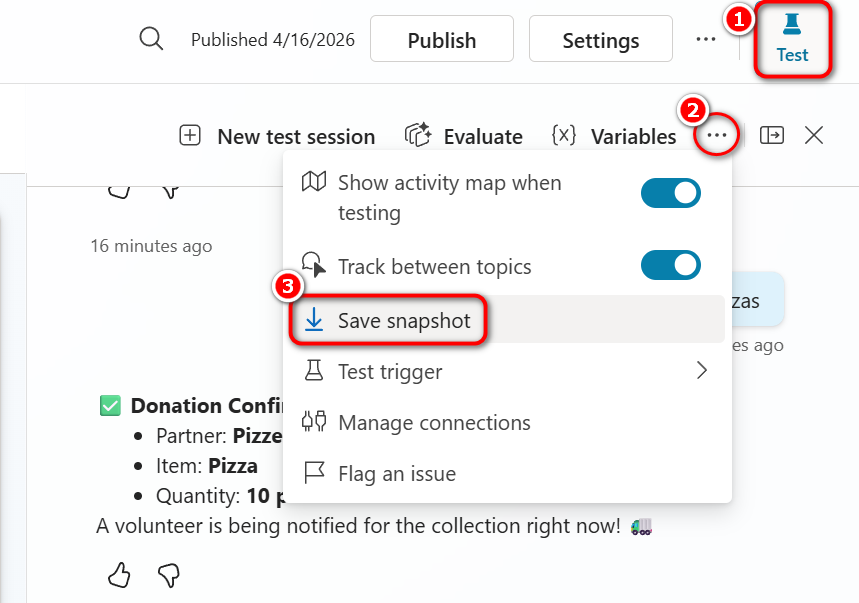
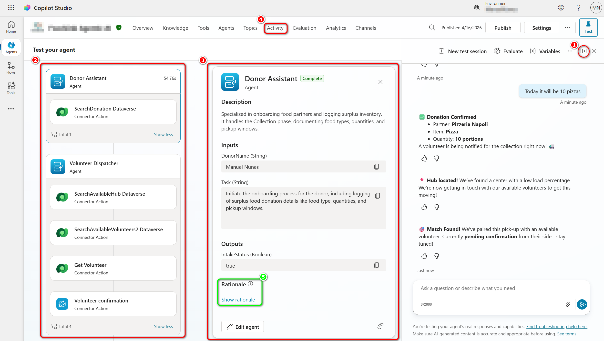
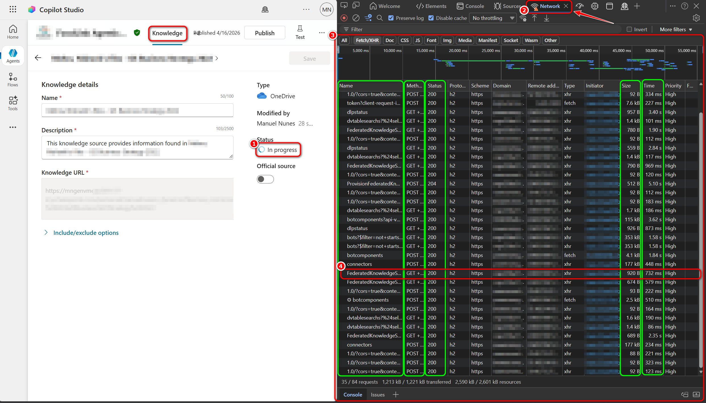
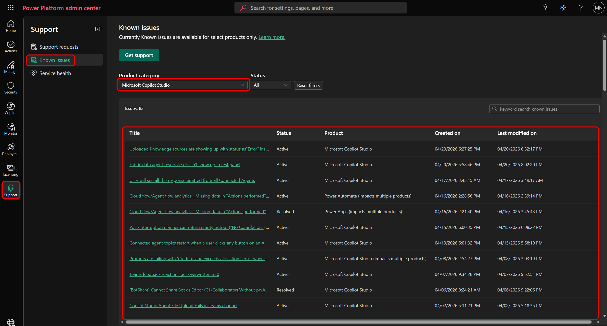

# 00 — Diagnostic toolbox

This page introduces the **shared set of tools** you will reuse across every troubleshooting scenario. The other section pages ([Basic](./01-basic.md), [Intermediate](./02-intermediate.md), [Advanced](./03-advanced.md)) link back here instead of re-explaining each tool.

> [!TIP]
> **Always start with the Test pane.** It is the fastest way to confirm whether an issue is reproducible inside Copilot Studio itself, or whether it only appears in a specific channel / environment.

> [!TIP]
> **Before you debug, check if Microsoft already knows.** The [**Power Platform Known Issues**](https://admin.powerplatform.microsoft.com/support/knownIssues) page lists active service-side bugs and workarounds across Copilot Studio, Power Apps, Power Automate, and Dataverse — filterable by product. See [§5 → Known issues page](#known-issues-page) for how to use it.

> [!IMPORTANT]
> **Sensitivity.** Several of these tools produce artifacts (Test pane snapshots, App Insights queries, HAR files) that contain **tokens, cookies, user messages, and business data**. Always **review and redact** before sharing externally, and never commit them to a public repo. Rows marked ⚠️ below are the ones to watch.

## At a glance

| Tool | Sensitivity | What it tells you | When to use it |
|------|:---:|-------------------|----------------|
| [1. Test pane](#1-test-pane) | ⚠️ | Does the agent behave correctly *inside Copilot Studio*? | Always first. Reproduce the issue here before going anywhere else. |
| [2. Activity map](#2-activity-map) | ⚠️ | *What* happened in a turn (topics / tools / knowledge / connected agents) **and** *why* the orchestrator picked each step (Rationale). | When the agent picks the "wrong" thing, ignores instructions, or returns *"I don't know"*. |
| [3. Application Insights](#3-application-insights) | ⚠️ | Telemetry across sessions, channels, and time. | Intermittent issues, channel-only issues, production monitoring. |
| [4. Browser network trace (HAR)](#4-browser-network-trace-har) | ⚠️ | Raw HTTP requests, response codes, payloads, and timings between the browser and the Copilot Studio portal. | Portal-side errors, silent failures, 4xx/5xx responses, CORS / auth handshake issues. |
| [5. Additional diagnostics](#5-additional-diagnostics) | · | Environment, governance, ALM, and the **Known Issues** page (PPAC, Solution Checker, Microsoft-published service issues). | Environment / licensing issues, ALM failures, or to check whether Microsoft has already flagged a service-side bug. |

---

## 1. Test pane

The **Test pane** is the chat surface inside the Copilot Studio authoring portal. It runs the agent end-to-end against your saved (unpublished) changes, with full access to the Activity map and orchestrator rationale — so it's where you reproduce *and* diagnose most issues before looking at any other tool.

### Built-in `/debug` commands

The Test pane accepts a couple of system commands that every maker should know:

| Command | What it does | When to use it |
|---|---|---|
| `/debug conversationId` | Returns the current conversation id. | **Always grab this first** — it's the key you'll use to find the same turn in [Application Insights](#3-application-insights), in flow run history, or when asking for help. |
| `/debug clearstate` | Resets the conversation state (variables, slots, auth). | Before re-running a failing scenario from a clean slate, without losing the same Test-pane session. |

### Download a Test pane snapshot

The Test pane can export the **full conversation snapshot** as a file: messages, variables at each turn, topic / tool / knowledge calls, and orchestrator decisions for the entire session. This is the single most useful artifact.

**How to capture:**

0. Reproduce the issue end-to-end in the Test pane (don't refresh after the failure).
1. Make sure the Test pane is open (**Test** button, top-right of the portal).
2. In the Test pane toolbar, click the `…` overflow menu and choose **Save snapshot**.
3. Save the file and pair it with the conversation id from `/debug conversationId`.

*Sensitivity:* the snapshot contains user messages, variable values, and connector / knowledge outputs — redact before sharing (see the sensitivity note at the top of this page).

> [!TIP]
> The downloaded `botContent.zip` contains a `dialog.json` (full orchestrator trace) and a `botContent.yml` (agent definition). Reading them by hand is slow — for a deeper analysis (timeline, plan tree, knowledge sources, citations, errors, performance waterfall) see **[03 — Advanced § Parsing a snapshot with Copilot Studio Trace Viewer](./03-advanced.md#deep-dive-parsing-a-snapshot-with-copilot-studio-trace-viewer)**.

**Key takeaway:** if you cannot reproduce the issue here, it is almost certainly a channel, identity, or environment issue — not an authoring issue.

## 2. Activity map

The [**Activity map**](https://learn.microsoft.com/en-us/microsoft-copilot-studio/authoring-review-activity) is the **"what happened"** view of a turn. It shows the chain of nodes the agent executed — connected agents, topic triggers, tool calls, knowledge lookups, generative answer steps — in the order they ran. Use it whenever the agent's *outcome* is wrong: wrong topic fired, expected tool not called, connected agent skipped, knowledge source not used.

Think of it as the **call stack** for a conversation turn.

**Highlights above:**

1. **Activity map toggle** (top-right of the Test pane) — switches the Test pane between the chat view and the activity view for the **current conversation**.
2. **Activity map** — the ordered list of everything the agent did for the selected turn: connected agents (e.g. *Donor Assistant*, *Volunteer Dispatcher*), connector / Dataverse actions, topics, and tools. Click any item to drill in.
3. **Details pane** — for the item selected in the map, shows its **Description**, **Inputs**, and **Outputs**. This is your primary "did it get the right inputs / produce the right outputs?" view.
4. **Activity tab** — opens the **history of past conversations** (not just the current Test pane session), so you can replay and inspect activity maps from previous runs, including channel sessions.
5. **Show rationale** — for agents with **generative orchestration enabled**, click this to see *why* the orchestrator picked the step. See [the subsection below](#reading-the-orchestrators-rationale-the-why).

### Reading the orchestrator's rationale (the *why*)

Click **Show rationale** (highlight #5 above) to see the inputs the orchestrator considered — user message, available tools / topics, instructions, recent context — and the justification for the chosen action. Available only when generative orchestration is enabled.

**Common patterns to look for:**

- Vague tool / topic descriptions causing misrouting.
- Instructions that conflict with each other.
- The orchestrator concluding it has no relevant capability for the user's intent.

For a deeper offline analysis (full plan tree, AI thoughts, knowledge sources, citation mapping, performance waterfall) capture a [Test pane snapshot](#download-a-test-pane-snapshot) and parse it with the **[Copilot Studio Trace Viewer](./03-advanced.md#deep-dive-parsing-a-snapshot-with-copilot-studio-trace-viewer)** — covered in the Advanced page.

*Sensitivity:* the rationale includes the user message, instructions, and tool descriptions — see the sensitivity note at the top of this page.

## 3. Application Insights

*Prereq:* agent **monitoring enabled** and a connected Application Insights workspace (see [Lab 1.7](../../labs/1.7-monitoring/1.7.1-monitor-agent-with-application-insights.md)).

Copilot Studio gives you **two complementary telemetry surfaces**:

- [**Native Copilot Studio analytics**](https://learn.microsoft.com/en-us/microsoft-copilot-studio/analytics-overview) (built into the portal): conversation counts, top topics, escalations, customer satisfaction, session transcripts. Best for *product-level* health.
- [**Application Insights** (Azure)](https://learn.microsoft.com/en-us/dynamics365/guidance/resources/copilot-studio-appinsights): per-turn events, dependency calls, latency, exceptions, custom KQL. Best for *engineering-level* debugging and for correlating across Copilot Studio + Power Automate + Azure dependencies.

Use native analytics for trends and Application Insights when you need to chase a specific failing turn end-to-end.

> [!TIP]
> See [Lab 1.7 — Monitor agent with Azure Application Insights](../../labs/1.7-monitoring/1.7.1-monitor-agent-with-application-insights.md) for the full setup walkthrough.

## 4. Browser network trace (HAR)

Use a [browser network trace](https://learn.microsoft.com/en-us/azure/azure-portal/capture-browser-trace) when the **portal itself** misbehaves and the real error is hidden from the UI. Typical fits: a portal action **fails silently** (no banner / toast); a toast shows an **HTTP 4xx / 5xx** with no actionable detail; **auth or consent popups** loop or close immediately; a control like **Channels**, **Knowledge**, or **Publish** won't render; or you need to confirm whether a request even **left the browser** vs. being blocked by a tenant policy or browser extension.

> [!NOTE]
> **Scope:** client ↔ portal API calls only. For server-side processing (knowledge ingestion, async jobs, runtime telemetry) use the [Test pane snapshot](#download-a-test-pane-snapshot) and [Application Insights](#3-application-insights) instead.

*Sensitivity:* HAR files contain cookies and bearer tokens — see the sensitivity note at the top of this page.

### How to capture a HAR (any Chromium browser — Edge / Chrome)

1. Open an **InPrivate / Incognito window**, sign in, and navigate close to the failing action.
2. **F12** → **Network** tab → tick **Preserve log** and **Disable cache**.
3. Reproduce the issue. Right-click the request list → **Save all as HAR with content**.
4. In the request list, look for **Status** 4xx / 5xx, unusually long **Time**, or unexpected **Size**. Click the row → check **Headers**, **Payload**, and **Response** — the response body usually contains the real error message.

**How to read the screenshot above:**

1. **The portal action under investigation** — here, a Knowledge source on the agent's **Knowledge** page that is stuck on **In progress**. This is exactly the kind of UI-driven, half-failing state where a network trace pays off.
2. **DevTools → Network tab** — open it (F12) before reproducing the action so every request is captured. Use **Preserve log** and **Disable cache** while debugging.
3. **Request list** — for each row, scan **Name** (operation), **Method**, **Status**, **Size**, and **Time** to spot the one that failed (4xx / 5xx), is unusually slow, or returned an unexpected payload.
4. **Per-request details** — click the suspect row to open **Headers**, **Payload**, and **Response** tabs. The response body is usually where the real error message lives (the toast in the portal often hides it).
5. **Download the HAR file** — right-click the request list → **Save all as HAR with content** and save the `.har` file locally. Remember to **redact tokens and cookies** before sharing externally.

> [!TIP]
> Interpreting status codes, correlation ids, CORS, and throttling — and correlating with conversation telemetry — is covered in **[03 — Advanced § Reading a HAR / network trace](./03-advanced.md#deep-dive-reading-a-har--network-trace)**.

## 5. Additional diagnostics

Surfaces you'll reach for less often, but that are essential when the issue is environmental, governance-related, or ALM-related rather than authoring-related.

### Power Platform Admin Center (PPAC)

Use the [**Power Platform Admin Center (PPAC)**](https://admin.powerplatform.microsoft.com/copilot/copilotstudio) to confirm the agent's **environment**, the **DLP policies** in effect (which connectors are blocked), and the **capacity / messages** consumption (PAYG, P1, P3). Go here when an issue is environment-specific ("works for me, not for them") or licensing-related.

> [!IMPORTANT]
> **DLP for Copilot Studio is disabled by default in all tenants** unless an admin has explicitly configured it. If a maker reports "my connector won't run" but DLP isn't configured, DLP is unlikely to be the cause — look at the connection / consent / RBAC instead.

### Solution Checker / ALM

*Prereq:* the agent packaged in a **solution** (not just sitting in the default solution).

Run [**Solution Checker**](https://learn.microsoft.com/en-us/power-apps/maker/data-platform/use-powerapps-checker) on the Copilot Studio solution to surface import / export errors, missing dependencies, and environment drift before promoting across DEV / TEST / PROD. See [Lab 1.6 — ALM](../../labs/1.6-application-lifecycle-management/1.6.1-manual-import-export.md) for the full pipeline workflow.

### Known Issues page

The [**Power Platform Known Issues**](https://admin.powerplatform.microsoft.com/support/knownIssues) page (in PPAC) and its [**documentation**](https://learn.microsoft.com/en-us/power-platform/admin/view-known-issues) list **service-side bugs Microsoft has acknowledged** — with status, affected versions, and workarounds where available. Always check it **before** filing a support ticket or going deep on a HAR / App Insights investigation: a known issue with a documented workaround will save hours.

**How to use it.**

1. Open <https://admin.powerplatform.microsoft.com/support/knownIssues> (requires Power Platform admin access; makers can ask their admin to check, or read the public docs page above).
2. Filter by **Product = Microsoft Copilot Studio** (and optionally by region / status).
3. Search for keywords from the error banner, the failing operation, or the affected feature (e.g. *"publish"*, *"Teams channel"*, *"knowledge"*).
4. If you find a match, capture the **issue ID** and **workaround** — reference both in your internal triage notes and in any support ticket.

---

← Back to the [Troubleshooting index](./README.md)
