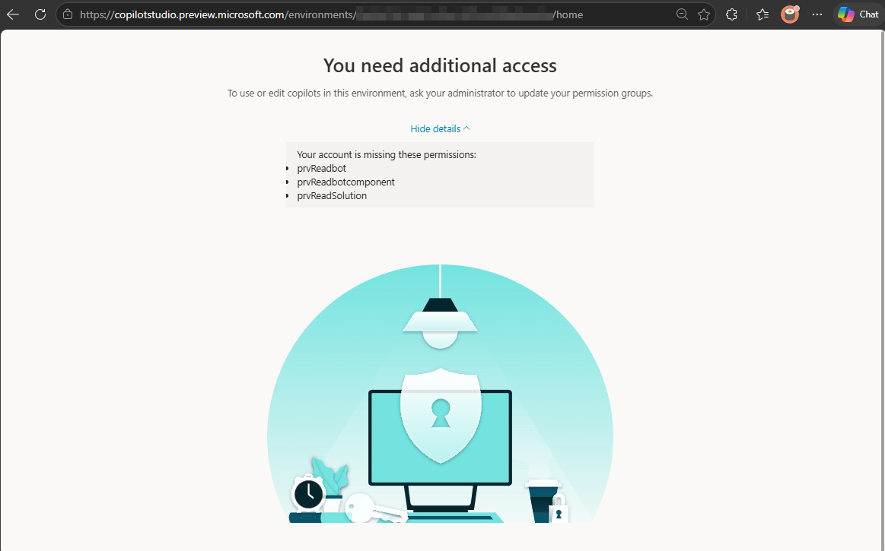
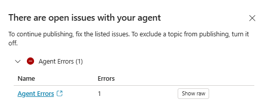
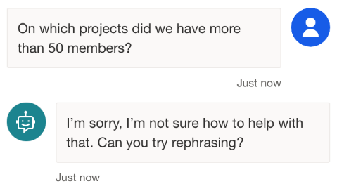
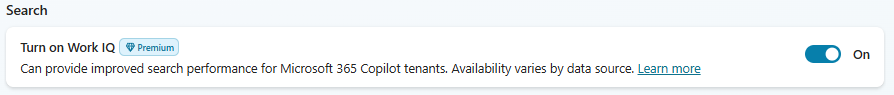
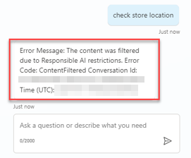
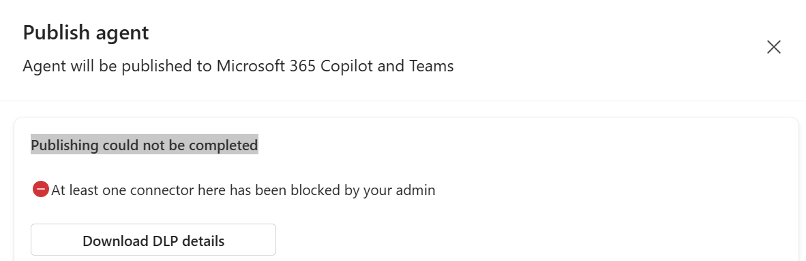

# 01 — Basic troubleshooting (Copilot Studio portal)

The **day-1 issues** every maker hits while authoring an agent in the Copilot Studio portal. If you're new here, start at the top and work down.

> [!TIP]
> **Always reproduce in the [Test pane](./00-diagnostic-toolbox.md#1-test-pane) first.** If the issue does not reproduce in the portal, it's likely a channel/auth problem — see [02 — Intermediate § I1](./02-intermediate.md#i1--user-is-asked-to-sign-in-repeatedly--auth-loop).

## How to diagnose this area

A short, repeatable diagnostic flow for basic issues — applied with tools from the [Diagnostic toolbox](./00-diagnostic-toolbox.md). (Step 1 — reproduce in the Test pane — is assumed; see the tip above.)

1. **Check the [Known Issues page](./00-diagnostic-toolbox.md#known-issues-page).** Filter by **Microsoft Copilot Studio** and search the error text. If Microsoft has already acknowledged it, follow the workaround and stop here.
2. **Open the [Activity map](./00-diagnostic-toolbox.md#2-activity-map)** for that conversation. Confirm whether the expected topic / knowledge call was triggered at all.
3. **Inspect variables** at the failing turn. Most basic issues are an empty / wrong variable, not a logic bug.
4. **Check the agent's publish state.** Many "it doesn't work" reports are simply unpublished changes.
5. **Check licensing / environment** in the [Power Platform Admin Center](./00-diagnostic-toolbox.md#power-platform-admin-center-ppac) only if steps 1–4 don't explain the symptom.

## Common issues at a glance

| # | Symptom | Likely cause | Jump to |
|---|---------|--------------|---------|
| B1 | Can't sign in / no environments listed | Licensing / wrong tenant / no Dataverse DB | [B1](#b1--cant-sign-in-or-no-environments-listed) |
| B2 | Save or Publish fails | Validation errors, source limits, ALM deps | [B2](#b2--save-or-publish-fails) |
| B3 | Topic, agent, or tool does not trigger | Trigger phrases, descriptions, orchestration routing | [B3](#b3--topic-agent-or-tool-does-not-trigger) |
| B4 | Generative answers return empty | Wrong / missing source, permissions, region | [B4](#b4--generative-answers-return-empty) |
| B5 | Knowledge returns wrong results | Scope too broad, vague description, indexing | [B5](#b5--knowledge-source-returns-wrong-results) |
| B6 | Test pane runtime error | Error code, in-reply error, variable empty, flow failure | [B6](#b6--test-pane-shows-a-runtime-error) |
| B7 | "Publish not allowed" after channel change | Channel / auth out of sync, DLP policy | [B7](#b7--publish-not-allowed-after-teams--m365-copilot-channel-changes) |

---

## B1 — Can't sign in or no environments listed

Environment picker is empty or missing your target environment. *(Pre-authoring issue — Test pane N/A.)*

**Diagnose & fix.**

1. **No Dataverse database** — In [PPAC](https://admin.powerplatform.com/), confirm the environment exists and has a database; [create one](https://learn.microsoft.com/en-us/power-platform/admin/create-database) if not.
2. **Missing permissions** — Verify the user has the **Environment Maker** security role (or higher) in the target environment.
3. **Unsupported region / wrong environment** — The M365 Copilot Chat environment isn't meant for Copilot Studio. Switch to a production or sandbox environment in a [supported region](https://learn.microsoft.com/en-us/microsoft-copilot-studio/data-location).
4. **Domain transfer** — Verify the user's new UPN and licensing, then resync security roles in that environment.

**Verify:** environment appears in the picker and opens normally.
**See also:** [Environments in Copilot Studio](https://learn.microsoft.com/en-us/microsoft-copilot-studio/environments-first-run-experience) · [Troubleshooting hub](https://learn.microsoft.com/en-us/troubleshoot/power-platform/copilot-studio/welcome-copilot-studio)

---

## B2 — Save or Publish fails

**Save** or **Publish** fails, shows an error banner, or never completes. *(Authoring action — Test pane usually N/A; capture runtime failures separately.)*

**Diagnose & fix.**

1. **Validation error** — Capture the exact error text / error code and run **Topic checker** ([view topic errors](https://learn.microsoft.com/en-us/microsoft-copilot-studio/authoring-topic-management#view-topic-errors)).
2. **Knowledge-source limits** — Reduce public sources in the failing generative answers node; check the [quotas page](https://learn.microsoft.com/en-us/microsoft-copilot-studio/requirements-quotas).
3. **ALM / managed-solution** — Open the solution in Power Apps and confirm required dependencies (workflows, environment variables) are included.
4. **Service-side issue** — Portal freezes or affects multiple users? Capture a [HAR](./00-diagnostic-toolbox.md#4-browser-network-trace-har) and check the [Known Issues page](./00-diagnostic-toolbox.md#known-issues-page).

**Verify:** Save / Publish completes; reopening the agent shows the latest changes.
**See also:** [B7 (channel-specific publish failure)](#b7--publish-not-allowed-after-teams--m365-copilot-channel-changes) · [Quotas & limits](https://learn.microsoft.com/en-us/microsoft-copilot-studio/requirements-quotas) · [Troubleshooting hub](https://learn.microsoft.com/en-us/troubleshoot/power-platform/copilot-studio/welcome-copilot-studio)

---

## B3 — Topic, agent, or tool does not trigger

User sends a phrase that should invoke a topic, connected agent, or tool, but the orchestrator picks a different path (wrong topic, generative answers, or fallback). *(Reproduce in the Test pane, then open the [Activity map](./00-diagnostic-toolbox.md#2-activity-map).)*

**Diagnose & fix.**

> [!IMPORTANT]
> The orchestrator relies on the **name** and **description** of every topic, connected agent, and tool to decide when to route. Vague, generic or conflicting descriptions are the #1 cause of mis-routing.

1. **Trigger phrases too narrow / overlapping** — Compare the user's phrase with the topic's triggers; broaden or disambiguate.
2. **Connected-agent or tool description too vague** — Make the name and description specific about what the agent/tool does and when it should be called.
3. **Generative orchestration chose another path** — Click **Show rationale** in the Activity map to see why; refine the topic, agent, or tool descriptions.
4. **Item disabled or unpublished** — Re-enable the topic / tool, or re-add the connected agent, then publish.

**Verify:** same phrase in the Test pane → expected topic, agent, or tool lights up in the Activity map.
**See also:** [Review agent activity](https://learn.microsoft.com/en-us/microsoft-copilot-studio/authoring-review-activity) · [Generative answers node](https://learn.microsoft.com/en-us/microsoft-copilot-studio/nlu-boost-node)

---

## B4 — Generative answers return empty

Agent says **"I'm not sure how to help with that"** instead of returning a grounded answer. *(Reproduce in the Test pane; check the Activity map to see if a knowledge step was attempted.)*

**Diagnose & fix.**

1. **Source not attached (or attached at the wrong level)** — Topic-level sources override agent-level. Confirm the right source is attached where the question is handled.
2. **SharePoint / OneDrive permissions** — Verify the user has read access and the agent auth includes `Sites.Read.All` + `Files.Read.All` scopes with consent.
3. **Limits / unsupported content** — Check [quotas & limits](https://learn.microsoft.com/en-us/microsoft-copilot-studio/requirements-quotas) for supported file types and sizes.
4. **"Generative AI not available"** — Review [regional / data-movement settings](https://learn.microsoft.com/en-us/microsoft-copilot-studio/data-location).
5. **Content moderation blocking** — Test with [moderation](https://learn.microsoft.com/en-us/microsoft-copilot-studio/knowledge-copilot-studio#content-moderation) lowered to confirm.

**Verify:** same question returns a grounded answer with citations.
**See also:** [SharePoint generative answers](https://learn.microsoft.com/en-us/microsoft-copilot-studio/nlu-generative-answers-sharepoint-onedrive) · [Knowledge sources](https://learn.microsoft.com/en-us/microsoft-copilot-studio/knowledge-copilot-studio) · [Data locations](https://learn.microsoft.com/en-us/microsoft-copilot-studio/data-location)

---

## B5 — Knowledge source returns wrong results

Agent returns results, but from the wrong document or with the wrong citation. *(Reproduce in the Test pane; inspect the Activity map + returned citations.)*

**Diagnose & fix.**

1. **Scope too broad** — For SharePoint, Copilot Studio searches the URL *and all subpaths*. Narrow to a more specific site / subpath.
2. **Vague source description** — Make the source **name** and **description** explicit about content and intended use; this directly helps generative orchestration.
3. **Connector-based knowledge** — Verify semantic labels, indexing completeness, [Work IQ](https://learn.microsoft.com/en-us/microsoft-copilot-studio/knowledge-copilot-studio#tenant-graph-grounding-with-semantic-search), and auth scopes.

4. **Permissions skew** — Users only see content they can access; different users may get different results.

**Verify:** same question returns the correct citation from the expected source.
**See also:** [Add SharePoint knowledge](https://learn.microsoft.com/en-us/microsoft-copilot-studio/knowledge-add-sharepoint) · [Quotas & limits](https://learn.microsoft.com/en-us/microsoft-copilot-studio/requirements-quotas) · [Knowledge sources](https://learn.microsoft.com/en-us/microsoft-copilot-studio/knowledge-copilot-studio)

---

## B6 — Test pane shows a runtime error

Test pane shows a system error banner, an error code, stops responding, or the agent replies with an error message directly in the conversation (e.g. *"Something went wrong"*, *"Sorry, I encountered an error"*, or a raw exception string). *(Reproduce, [save a snapshot](./00-diagnostic-toolbox.md#download-a-test-pane-snapshot), and capture the conversation ID.)*

**Diagnose & fix.**

1. **Error code surfaced (banner or in-reply)** — Record the exact text and open **Topic checker**; look it up in the [error-code reference](https://learn.microsoft.com/en-us/troubleshoot/power-platform/copilot-studio/authoring/error-codes).
2. **Error appears in the agent's reply** — Open the [Activity map](./00-diagnostic-toolbox.md#2-activity-map) and check which node produced the reply. Common causes: a Power Automate flow returned an error that the topic surfaced as a message, or a generative answers / plugin call failed and the fallback text was shown.
3. **Variable / parameter empty** — In the Activity map, inspect the failing step's inputs / outputs for missing or null values.
4. **Test pane hangs after first turn** — Check the browser Network tab for a missing or blocked `/subscribe` request (corporate firewall / proxy).
5. **Connector / flow failure** — Jump to [02 — Intermediate](./02-intermediate.md).

**Verify:** same input completes successfully in the Test pane.
**See also:** [Error codes](https://learn.microsoft.com/en-us/troubleshoot/power-platform/copilot-studio/authoring/error-codes) · [Test your agent](https://learn.microsoft.com/en-us/microsoft-copilot-studio/authoring-test-bot)

---

## B7 — "Publish not allowed" after Teams / M365 Copilot channel changes

After toggling the **Teams** or **M365 Copilot** channel (often alongside an auth change), **Publish** fails or never completes. *(Authoring action — Test pane usually still works.)*

**Diagnose & fix.**

1. Open your agent → **Settings → Channels** and **remove** the affected channel.
2. Open **Settings → Security → Authentication** and confirm the auth option matches what the channel requires.
3. **Check DLP policies** — A Data Loss Prevention policy may block the channel connector. In [PPAC](https://admin.powerplatform.com/) → **Policies → Data policies**, verify the required connectors aren't in the **Blocked** group for this environment.
4. **Re-add** the channel end-to-end without skipping steps.
5. **Save** → **Publish**.

**Verify:** Publish completes; latest version loads in the target channel.
**See also:** [B2 (other publish failures)](#b2--save-or-publish-fails) · [02 § I1 Authentication loop](./02-intermediate.md#i1--user-is-asked-to-sign-in-repeatedly--auth-loop) · [Troubleshooting hub](https://learn.microsoft.com/en-us/troubleshoot/power-platform/copilot-studio/welcome-copilot-studio)

---

## Where to next

- Authentication, connectors, flows, environments → [02 — Intermediate](./02-intermediate.md)
- MCP, custom models, AI Search, Foundry IQ → [03 — Advanced](./03-advanced.md)
- Back to the [Diagnostic toolbox](./00-diagnostic-toolbox.md) or [troubleshooting index](./README.md)
