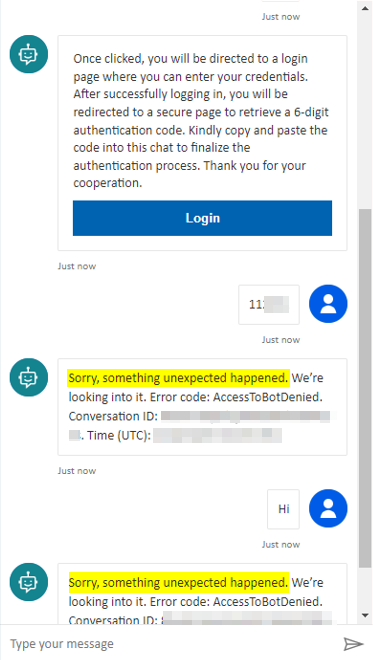
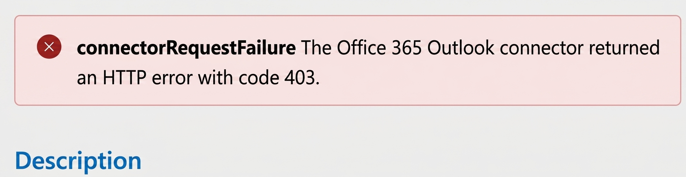
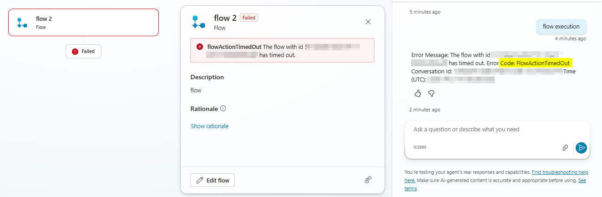
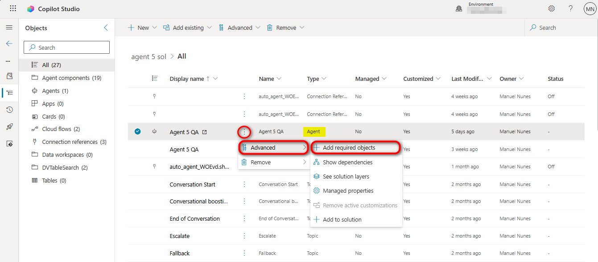
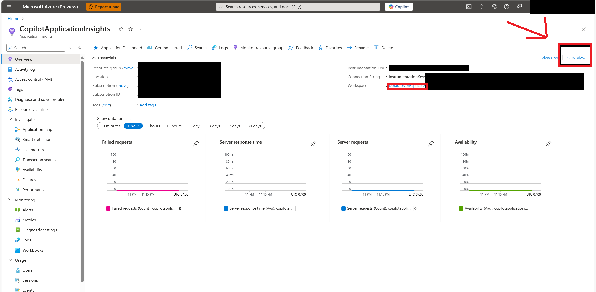

# 02 — Intermediate troubleshooting (Copilot Studio portal)

You've moved past the basics: your agent saves, publishes, and routes correctly. Now you're integrating it with **identity, connectors, flows, custom entities, environments, and telemetry**. This page covers the issues you typically hit there.

> [!TIP]
> Before opening Azure / Power Automate, **always reproduce in the [Test pane](./00-diagnostic-toolbox.md#1-test-pane) first** and capture the conversation id with `/debug conversationId` — it's how you'll find the matching telemetry in [Application Insights](./00-diagnostic-toolbox.md#3-application-insights).

## How to diagnose this area

1. **Reproduce in the Test pane** and copy the conversation id.
2. **Open the [Activity map](./00-diagnostic-toolbox.md#2-activity-map)** to find which action / connector / flow node failed.
3. **Inspect inputs and outputs** of that node — especially anything coming from a variable, a connection, or an OAuth token.
4. **Cross-reference with [Application Insights](./00-diagnostic-toolbox.md#3-application-insights)** if the failure is intermittent or only happens for some users.
5. **Check environment-level constraints** in the [Power Platform Admin Center](./00-diagnostic-toolbox.md#power-platform-admin-center-ppac) — DLP, capacity, region — when an action works for you (e.g. as a maker) but not for someone else.

## Common issues at a glance

| # | Symptom | Likely cause | Jump to |
|---|---------|--------------|---------|
| I1 | User asked to sign in repeatedly / auth loop | Misconfigured Entra app, redirect URI, scopes | [I1](#i1--user-is-asked-to-sign-in-repeatedly--auth-loop) |
| I2 | OAuth works for maker, fails for end users | Connection sharing, consent, Conditional Access | [I2](#i2--oauth-connection-works-for-the-maker-fails-for-end-users) |
| I3 | Connector action returns 401 / 403 | Stale credentials, missing scope, connection ownership | [I3](#i3--connector-action-returns-401--403) |
| I4 | Power Automate flow fails or times out | 100 s limit, maker connection, payload too large | [I4](#i4--power-automate-flow-called-from-agent-fails-or-times-out) |
| I5 | Variable is empty when used downstream | Scope mismatch, value not passed, type mismatch | [I5](#i5--variable-is-empty-when-used-downstream) |
| I6 | Custom entity not extracted / extracted wrong | Entity type mismatch, regex too strict, CLU out of sync | [I6](#i6--custom-entity-not-extracted--extracted-wrong) |
| I7 | Solution import fails between environments | Missing dependencies, connection references, auth | [I7](#i7--solution-import-fails-between-environments) |
| I8 | App Insights shows no data for the agent | Wrong resource, no interaction since connect, access | [I8](#i8--app-insights-shows-no-data-for-the-agent) |
| I9 | Uploaded files ignored by tools / actions | File not captured in variable, type / size unsupported | [I9](#i9--uploaded-files-attachments-are-ignored-by-tools--actions) |
| I10 | Knowledge source errors after solution import | Missing components, prerequisites, re-auth needed | [I10](#i10--knowledge-source-shows-an-error-after-solution-import) |
| I11 | "Download sessions" returns *Couldn't load data* | Missing security role, unsupported env type, date range | [I11](#i11--analytics--download-sessions-returns-couldnt-load-data) |

---

## I1 — User is asked to sign in repeatedly / auth loop

The agent keeps prompting the user to sign in, or the sign-in experience loops and never stabilizes. Authentication changes only take effect **after you publish**. *(Reproducible in the Test pane with manual authentication, or in the target channel — auth prompts depend on the channel and Entra configuration.)*

**Diagnose & fix.**

1. **Incomplete auth config** — Open the agent's authentication settings and verify the provider, tenant ID, scopes, redirect URI, and any token exchange settings. **Publish** before testing again.
2. **Missing admin consent** — In the Entra app registration, confirm the required permissions are present and consented.
3. **Teams SSO not kicking in** — Silent SSO is only expected in **1:1 chats** when the agent uses *Authenticate with Microsoft* and the Teams SSO app registration is configured correctly. If you changed auth mode after first publish, republish and retest in a 1:1 Teams chat.
4. **Browser blocking sign-in** — Test in a normal browser profile (not private mode) and confirm third-party cookies and the sign-in popup aren't blocked.
5. **Conditional Access blocking the agent** — Have an Entra admin review Conditional Access failures for Copilot Studio in **sign-in logs**. Conditional Access can block token acquisition and make the agent appear unavailable.

**Verify:** the user signs in once and the conversation starts normally in the target channel.
**See also:** [Error codes](https://learn.microsoft.com/en-us/troubleshoot/power-platform/copilot-studio/authoring/error-codes) · [Configure user authentication](https://learn.microsoft.com/en-us/microsoft-copilot-studio/configuration-end-user-authentication) · [Conditional Access in Copilot Studio](https://learn.microsoft.com/en-us/microsoft-copilot-studio/security-conditional-access)

---

## I2 — OAuth connection works for the maker, fails for end users

The maker can use the agent successfully, but other users fail when the agent calls an OAuth-backed action. The connection is tied to the maker's identity, hiding the problem from the maker. *(Reproduce with a non-maker user in the published channel.)*

**Diagnose & fix.**

1. **Connection tied to maker** — Sharing the agent alone is not enough. For OAuth-backed services, the durable options are: service principal authentication, environment-level connections, or per-user sign-in.
2. **Missing connection permissions** — If a flow or connection reference is involved, ensure the user who runs it has permission to use all required connections.
3. **Missing consent** — Confirm the required API permissions are granted and admin-consented.
4. **Managed Environment sharing limits** — Check whether Managed Environment restrictions are limiting how broadly the underlying agent flow or app can be shared.
5. **Conditional Access** — If only some users fail, check Conditional Access policies next.

> [!TIP]
> For multi-environment rollouts, map Entra security groups to Dataverse teams / roles per environment so the same user gets the right connection permissions in Dev / Test / Prod instead of relying on ad-hoc sharing.

**Verify:** a non-maker user completes the same scenario without relying on the maker's credentials.
**See also:** [Share agents with other users](https://learn.microsoft.com/en-us/microsoft-copilot-studio/admin-share-bots) · [Connection references in solutions](https://learn.microsoft.com/en-us/power-apps/maker/data-platform/create-connection-reference) · [Conditional Access](https://learn.microsoft.com/en-us/microsoft-copilot-studio/security-conditional-access)

---

## I3 — Connector action returns 401 / 403

A connector or API action fails with **401 Unauthorized** or **403 Forbidden**. A 401 points to authentication token issues; a 403 indicates insufficient permissions. *(Reproduce in the Test pane and inspect the failing action.)*

**Diagnose & fix.**

1. **Stale credentials** — Open the failing action, check which connection it uses, and re-authenticate or update credentials.
2. **Dataverse identity behind the action** — A 403 can come from the Dataverse user/account backing the action, not just the chat user. Verify the account is enabled in the environment and has the required security role.
3. **Connection ownership** — If a connection reference is involved, verify the user who runs the flow has permission to use it.
4. **Missing auth inputs** — Check the action inputs carefully — URL, headers, auth parameters, and any mapped values from the topic. If the root cause isn't obvious, reproduce the same request in the service's own test tool or an API client.
5. **Response too large** — If the action fails with a generic request error rather than 401/403, confirm the connector response doesn't exceed **500 KB**.
6. **Re-test** in the Test pane after reconnecting.

**Verify:** the action returns successfully and the prompt no longer fails with 401 or 403.
**See also:** [Error codes](https://learn.microsoft.com/en-us/troubleshoot/power-platform/copilot-studio/authoring/error-codes) · [Manage connections in Power Automate](https://learn.microsoft.com/en-us/power-automate/add-manage-connections) · [Manage connections in canvas apps](https://learn.microsoft.com/en-us/power-apps/maker/canvas-apps/add-manage-connections) · [Connection references in solutions](https://learn.microsoft.com/en-us/power-apps/maker/data-platform/create-connection-reference)

---

## I4 — Power Automate/Agent flow called from agent fails or times out

An agent-triggered cloud flow fails, or the agent reports a timeout. Copilot Studio has a **100-second** return limit for agent flows (`FlowActionTimedOut`). The flow must be in the **same environment** as the agent and use the **Run a flow from Copilot** trigger. *(Reproduce in the Test pane, then inspect the flow's Run History in Power Automate.)*

**Diagnose & fix.**

1. **Check Run History** — Open the failed run in Power Automate and inspect the failing step and returned data.
2. **Flow times out** — Move any work that can continue later to *after* the **Respond to Copilot** step and return a minimal response first.
3. **Reduce flow overhead** — If latency is the main problem, prefer direct connector or HTTP actions in Copilot Studio when possible, or enable express mode if your environment supports it.
4. **Payload too large** — Reduce the data you query and return. Large connector responses can fail; use async or split patterns for heavy operations.
5. **Maker connection not allowed** — If the error mentions a maker connection, switch to a supported connection setup and share the flow with run-only permissions.

**Verify:** the flow run completes and the agent receives the response within the allowed time.
**See also:** [Error codes](https://learn.microsoft.com/en-us/troubleshoot/power-platform/copilot-studio/authoring/error-codes) · [Power Automate limits](https://learn.microsoft.com/en-us/power-automate/limits-and-config) · [Fix connector request failure](https://learn.microsoft.com/en-us/troubleshoot/power-platform/copilot-studio/actions/connector-request-failure)

---

## I5 — Variable is empty when used downstream

A variable looks populated in one place but is empty later in the conversation or in another topic. Copilot Studio variables have defined scopes: **topic**, **global**, **system**, and **environment**. *(Reproduce in the Test pane and inspect where the value is first set and where it becomes empty.)*

**Diagnose & fix.**

1. **Scope mismatch** — The variable is topic-scoped but you're trying to use it in another topic. Make it global or pass it explicitly.
2. **Value not passed on redirect** — Configure the destination variable to **Receive values from other topics** and pass the value during the redirect.
3. **Type mismatch** — Confirm the variable type matches what the topic, action, or condition expects.
4. **Environment variable appears empty** — Environment variables are read-only in Copilot Studio and are meant to vary by environment during ALM. If something works in one environment but looks empty in another, check the environment variable's value in the target environment.
5. **Stale session** — After changing variable scope, topic mappings, or environment-variable values, start a **fresh conversation**. Global variables are session-scoped, and environment-variable validation errors surface in the test chat / publish experience, not in the topic list.

**Verify:** the same value is still available when the downstream node or topic uses it.
**See also:** [Variables overview](https://learn.microsoft.com/en-us/microsoft-copilot-studio/authoring-variables-about) · [Work with variables](https://learn.microsoft.com/en-us/microsoft-copilot-studio/authoring-variables) · [Global variables](https://learn.microsoft.com/en-us/microsoft-copilot-studio/authoring-variables-bot)

---

## I6 — Custom entity not extracted / extracted wrong

A custom entity isn't recognized, or the wrong value is extracted from the user's input. Copilot Studio supports **closed list** and **regex** entities for domain-specific extraction. *(Reproduce in the Test pane with the exact utterance that failed.)*

**Diagnose & fix.**

1. **Wrong entity type** — Re-check whether the entity should be a closed list (predefined values) or regex (fixed formats like ticket IDs). Switch if needed.
2. **Closed list too narrow** — Expand the allowed values and synonyms so the agent can match more variations.
3. **Regex too strict** — Test the pattern carefully; make it case-insensitive if needed (regex entities are case-sensitive by default).
4. **Ambiguous extraction** — If one utterance contains several similar values, split into more specific custom entities instead of a generic built-in one.
5. **Azure CLU out of sync** — If you use Azure CLU, verify that the CLU model, imported entities, and topic bindings are in sync, and bulk-test representative utterances after each change.

**Verify:** the same utterance extracts the expected entity value consistently in the Test pane.
**See also:** [Entities and slot filling](https://learn.microsoft.com/en-us/microsoft-copilot-studio/advanced-entities-slot-filling) · [Slot-filling best practices](https://learn.microsoft.com/en-us/microsoft-copilot-studio/guidance/slot-filling-best-practices)

---

## I7 — Solution import fails between environments

A solution containing the agent fails to import into another environment, or imports but opens with broken dependencies. The most common cause is that the solution doesn't contain all required components. *(Not a Test pane issue — use the import log and solution explorer.)*

**Diagnose & fix.**

1. **Check the import log** — Re-import and download the log file to see the exact missing component or error.
2. **Add required objects** — In the source solution, use **Add required objects** for the agent component and any workflows, environment variables, and connection references it depends on.

3. **Broken connection references** — If custom connectors or connection references are involved and the normal dependency fix doesn't solve it, recreate the connection references inside the same solution, reassign them to the agent tools, publish, and re-export.
4. **Re-export and re-import** into the target environment.
5. **Reconfigure authentication** — After import, open the agent and configure user authentication again before publishing.

> [!IMPORTANT]
> Avoid using periods (`.`) in topic names — solutions containing such topics can't be exported cleanly.

**Verify:** the solution imports without errors, the agent opens in the target environment, and publish succeeds.
**See also:** [Error codes](https://learn.microsoft.com/en-us/troubleshoot/power-platform/copilot-studio/authoring/error-codes) · [Export and import agents using solutions](https://learn.microsoft.com/en-us/microsoft-copilot-studio/authoring-solutions-import-export) · [Troubleshoot missing dependencies](https://learn.microsoft.com/en-us/troubleshoot/power-platform/copilot-studio/lifecycle-management/agent-publish-missing-dependencies)

---

## I8 — App Insights shows no data for the agent

You connected the agent to Application Insights, but no telemetry appears. Telemetry is logged when users interact with the bot (including testing inside Copilot Studio) once the connection is correct. *(Reproduce in the Test pane, then check the Logs section of the Application Insights resource.)*

**Diagnose & fix.**

1. **Wrong resource configured** — Open the agent's **Analytics** settings and confirm which Application Insights resource is connected.
2. **No access** — Make sure you can access that exact resource in Azure, then open **Logs**.
3. **No fresh interaction** — Run a fresh test conversation, then query `customEvents` or check the built-in dashboard. Allow a few minutes for ingestion. (Test pane interactions are also logged.)
4. **Network blocking outbound telemetry** — If the resource is correct but stays blank, ask the network team to validate that firewalls, proxies, or VNet rules aren't blocking outbound calls to the Application Insights endpoint.
5. **Still empty** — Re-check the configured resource rather than assuming the issue is in topic logic.

**Verify:** a fresh test interaction appears in Application Insights logs or dashboards.
**See also:** [Capture telemetry with Application Insights](https://learn.microsoft.com/en-us/microsoft-copilot-studio/advanced-bot-framework-composer-capture-telemetry) · [Application Insights for Copilot Studio](https://learn.microsoft.com/en-us/dynamics365/guidance/resources/copilot-studio-appinsights)

---

## I9 — Uploaded files (attachments) are ignored by tools / actions

The user uploads a file, but the downstream tool, connector, or action acts as if no file was provided. Note two distinct scenarios: files the agent uses for **reasoning / knowledge** vs. files **passed into an action or tool** — the issue below applies to the second. *(Reproduce in the Test pane — attach the same file and inspect the action's inputs in the [Activity map](./00-diagnostic-toolbox.md#2-activity-map).)*

**Diagnose & fix.**

1. **Known issue with direct pass-through** — Files attached in chat are not reliably passed directly into tools / actions. Collect the file in a topic first (via a **Question** node or `First(System.Activity.Attachments)`), then pass the file variable to the downstream action.
2. **File input not enabled or unsupported** — Confirm file input is allowed for the agent and that the file type / size is supported.
3. **Variable not passed downstream** — Store the file in a variable and pass it to the downstream flow, connector, or tool.
4. **SharePoint channel** — If the agent is published to a SharePoint channel, users **cannot upload files** there. This is a channel-specific limitation.
5. **Re-test** the same scenario in the Test pane.

**Verify:** the downstream action receives the file and returns the expected output.
**See also:** [Allow file input from users](https://learn.microsoft.com/en-us/microsoft-copilot-studio/image-input-analysis) · [Pass files to agent flows, connectors, and tools](https://learn.microsoft.com/en-us/microsoft-copilot-studio/guidance/pass-files-to-connectors)

---

## I10 — Knowledge source shows an error after solution import

After importing a solution into another environment, one or more knowledge sources show errors or stop working. Imported agents often need post-import reconfiguration. *(Reproduce in the Test pane in the target environment — ask a question that should hit the affected source.)*

**Diagnose & fix.**

1. **Missing dependencies** — Review the solution import log and fix any missing components or connection references.
2. **Reconfigure authentication** — Open the imported agent and reconfigure user authentication if the agent expects authenticated knowledge access. For unstructured knowledge, re-establish the maker-side setup connection in the target environment.
3. **Missing prerequisites** — Validate prerequisites for the knowledge source in the target environment (e.g. Dataverse search must be enabled for uploaded files).
4. **Re-add or recreate the source** — If reconnecting doesn't fix it, remove and **recreate** the knowledge source in the target environment rather than continuing to debug the imported artifact.

**Verify:** the imported agent queries the knowledge source successfully in the target environment.
**See also:** [Export and import agents using solutions](https://learn.microsoft.com/en-us/microsoft-copilot-studio/authoring-solutions-import-export) · [Upload files as knowledge](https://learn.microsoft.com/en-us/microsoft-copilot-studio/knowledge-add-file-upload) · [Add unstructured data as knowledge](https://learn.microsoft.com/en-us/microsoft-copilot-studio/knowledge-add-unstructured-data)

---

## I11 — Analytics → "Download sessions" returns *Couldn't load data*

On the **Analytics** page, selecting **Download Sessions** shows *"Couldn't load data"* or fails to produce a downloadable file. *(Not a Test pane issue — troubleshoot from Analytics and environment settings.)*

**Diagnose & fix.**

1. **Missing security role** — Confirm the user has the **Bot Transcript Viewer** role in the environment. Treat this and transcript settings as the **first** checks, not the last.
2. **Transcript recording disabled** — Verify that transcript recording and download settings are enabled in the environment.
3. **Date range too wide** — Narrow to the last **29 days** and wait up to about an hour after a session ends before retrying.
4. **Trigger-only runs** — If the selected period contains only trigger-based runs and no conversation sessions, the pane can fail to populate even though analytics exist elsewhere.
5. **Unsupported environment / agent type** — Transcripts are **not written** for Dataverse for Teams environments, Dataverse developer environments, or Microsoft 365 Copilot agents. Use [Application Insights](./00-diagnostic-toolbox.md#3-application-insights) for telemetry instead.

**Verify:** the Download Sessions pane loads day rows and the CSV downloads successfully.
**See also:** [Downloaded session data from Copilot Studio](https://learn.microsoft.com/en-us/microsoft-copilot-studio/analytics-transcripts-studio) · [Downloaded transcripts from Power Apps](https://learn.microsoft.com/en-us/microsoft-copilot-studio/analytics-transcripts-powerapps) · [Analytics overview](https://learn.microsoft.com/en-us/microsoft-copilot-studio/analytics-overview)

---

## Where to next

- MCP tools, custom models, AI Search, Foundry IQ → [03 — Advanced](./03-advanced.md)
- Back to the [Diagnostic toolbox](./00-diagnostic-toolbox.md) or [troubleshooting index](./README.md)
