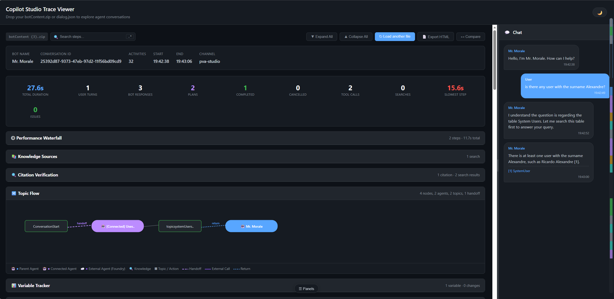
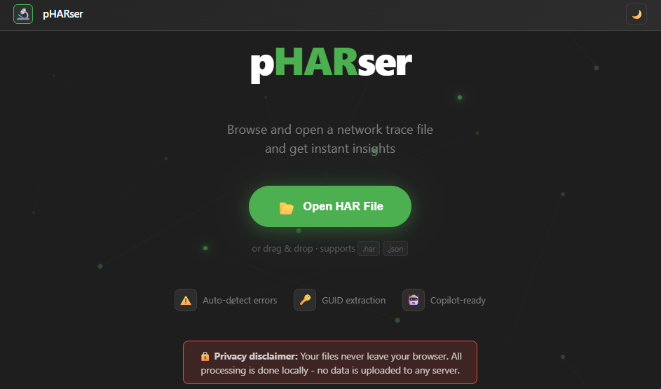
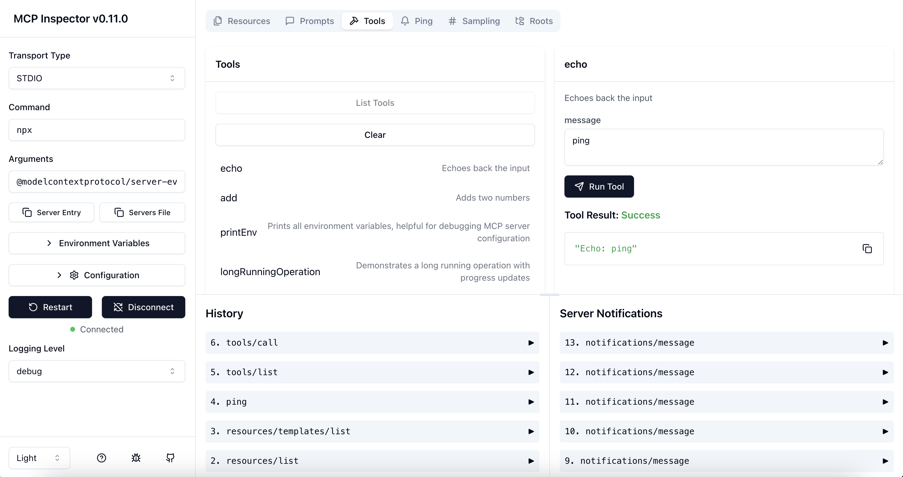
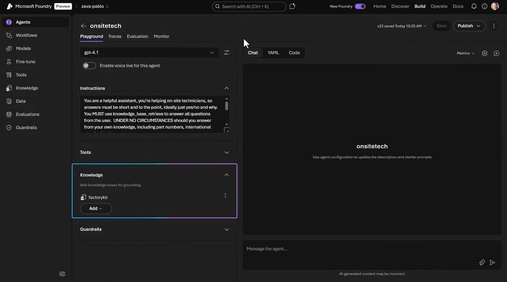
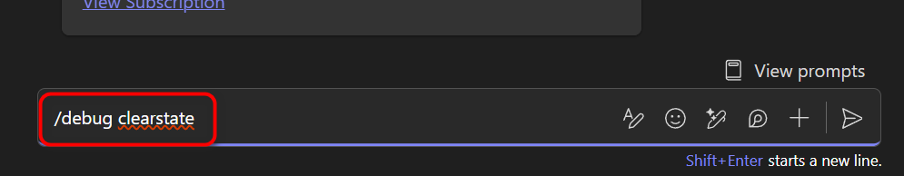
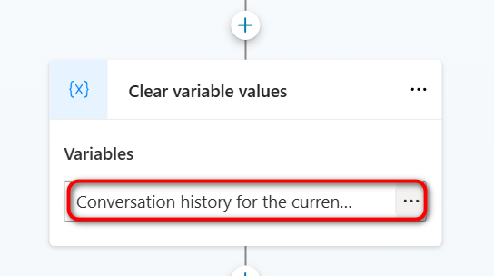

# 03 — Advanced troubleshooting (Copilot Studio portal)

You're integrating Copilot Studio with the broader Azure AI stack: **MCP tools, custom / fine-tuned models, Azure AI Search, Foundry IQ agentic retrieval, generative orchestration, and prompt / instruction tuning**. Issues here usually span multiple services, so the diagnostic loop is more involved.

> [!IMPORTANT]
> Advanced issues almost always require **correlated telemetry** across Copilot Studio, Power Automate, and the underlying Azure resources. Before you dig in, make sure [Application Insights](./00-diagnostic-toolbox.md#3-application-insights) is wired up and you can search by conversation id.

## How to diagnose this area

1. **Reproduce in the [Test pane](./00-diagnostic-toolbox.md#1-test-pane)** and capture the conversation id.
2. **Open the [Activity map](./00-diagnostic-toolbox.md#2-activity-map)** for the failing turn and click **Show rationale** on the suspect step — this is where most "the agent picked the wrong tool / model / source" issues are visible.
3. **Open [Application Insights](./00-diagnostic-toolbox.md#3-application-insights)** and pivot from the conversation id to the dependency calls (AI Search, Foundry, MCP server, custom model endpoint).
4. **Inspect the dependency** at its source (AI Search query, Foundry agent run, MCP server logs, fine-tuned deployment metrics).
5. **Iterate on instructions / prompts** *only after* the data flow above is verified — otherwise you'll be tuning prompts to compensate for a broken integration.

## Deep-dive: parsing a snapshot with Copilot Studio Trace Viewer

The [Test pane snapshot](./00-diagnostic-toolbox.md#download-a-test-pane-snapshot) (`botContent.zip`) contains `dialog.json` (full orchestrator trace) and `botContent.yml` (agent definition). Use this section when you need to understand **why the agent chose a specific tool, source, or response** for a given turn.

### Copilot Studio Trace Viewer

The **[Copilot Studio Trace Viewer](https://rquattros.github.io/CopilotStudioTraceViewer/)** ([GitHub](https://github.com/rquattros/CopilotStudioTraceViewer)) is a community-built, browser-only tool that parses these files and displays: activity timeline, performance waterfall, knowledge sources, variable tracker, topic flow, and error highlights. Nothing is uploaded to a server.

**How to use it:**

1. **Save snapshot** from the Test pane (see [toolbox steps](./00-diagnostic-toolbox.md#download-a-test-pane-snapshot)).
2. Open [rquattros.github.io/CopilotStudioTraceViewer](https://rquattros.github.io/CopilotStudioTraceViewer/) and drag the `.zip` (or `dialog.json`) onto the page.
3. Start with the **Error banner** → jump to the failing step → inspect **Knowledge Sources** / **Variable Tracker** / **Topic Flow**.
4. Pair with the conversation id from `/debug conversationId` and your [App Insights](./00-diagnostic-toolbox.md#3-application-insights) query.

## Deep-dive: reading a HAR / network trace

A HAR file captures every HTTP request the browser made during a session (see [Diagnostic toolbox §4](./00-diagnostic-toolbox.md#4-browser-network-trace-har)). Use this section when you need to identify the **first failing request** in a chain, extract correlation ids for a support ticket, or confirm an auth / RBAC root cause.

### pHARser

**[pHARser](https://pharser.azurewebsites.net/)** is a browser-based HAR viewer that presents requests in a structured, filterable format for spotting failures and extracting correlation ids. Nothing is uploaded to a server.

**How to use it:**

1. Open [pharser.azurewebsites.net](https://pharser.azurewebsites.net/).
2. Drag your `.har` file onto the page (or use the file picker).
3. Filter / sort by status code, time, or keyword to find the failing request.
4. Expand the request to inspect headers (`x-ms-correlation-id`, `x-ms-request-id`), payload, and response body.

### Signals to scan for first

| Signal | What it usually means | Where to check |
|---|---|---|
| **HTTP 401 / 403** on a Copilot Studio API call | Auth or RBAC problem (token expired, missing role on environment, conditional access). | Cross-check with [02 — Intermediate § I3 Connector returns 401 / 403](./02-intermediate.md#i3--connector-action-returns-401--403). |
| **HTTP 404** on an environment-scoped URL | Wrong environment selected, or the resource was deleted / moved. | Look for the environment id (GUID) in the request URL. |
| **HTTP 429** | Throttling. | Slow the action down; check capacity in [PPAC](./00-diagnostic-toolbox.md#power-platform-admin-center-ppac). |
| **HTTP 5xx** | Service-side issue. | Capture the `x-ms-correlation-id` / `x-ms-request-id` response header. |
| **CORS errors** in the Console tab | Tenant policy, browser extension, or a third-party domain blocked. | Retry in InPrivate with extensions disabled. |
| **Request never sent** (no row appears) | Browser extension, content-blocker, or network policy intercepted the click. | Retry in InPrivate, then on a clean network. |

### Triage workflow

1. **Filter** to `XHR` / `Fetch`, sort by **status code** descending, and find the **first** failing request in time order (later failures are usually cascading).
2. From that request, capture: **Request URL** (note the environment GUID), **status code**, response headers `x-ms-correlation-id` / `x-ms-request-id` / `request-id`, and **response body**.
3. If the failing request targets `/oauth2/`, `/.default`, or `login.microsoftonline.com`, the root cause is identity, not Copilot Studio.

### Correlate with conversation telemetry

If the failing action is a **conversation turn** (not a portal click):

1. Grab the conversation id with `/debug conversationId` in the [Test pane](./00-diagnostic-toolbox.md#1-test-pane) **before** triggering the failure.
2. Capture the HAR for the next turn.
3. In [Application Insights](./00-diagnostic-toolbox.md#3-application-insights), filter by that conversation id and align the `x-ms-correlation-id` from the HAR to the matching dependency call. You now have the **same failure visible from both client and server side**.

> [!IMPORTANT]
> A HAR contains tokens and cookies. Always **redact or sanitize** before sharing — pHARser has a built-in sanitize function that strips `Authorization`, `Cookie`, and other sensitive headers. Alternatively, open the file in a text editor and remove them manually before attaching to a ticket.

## Common issues at a glance

| # | Symptom | Likely cause | Jump to |
|---|---------|--------------|---------|
| A1 | MCP tool call fails or returns nothing | MCP server registration, auth, schema | [A1](#a1--mcp-tool-call-fails) |
| A2 | Azure AI Search returns no / poor results | Index design, query type, semantic config, scoring | [A2](#a2--azure-ai-search-returns-poor-results) |
| A3 | Foundry IQ agentic retrieval returns empty / wrong sources | Knowledge base scoping, permissions, source routing | [A3](#a3--foundry-iq-agentic-retrieval-issues) |
| A4 | Custom / fine-tuned model returns errors or off-style answers | Deployment, capacity, prompt drift, dataset quality | [A4](#a4--custom-or-fine-tuned-model-issues) |
| A5 | Citations are missing or wrong | Grounding off, source not citation-capable, post-processing | [A5](#a5--citations-missing-or-wrong) |
| A6 | High latency / timeouts on generative answers | Model region, payload size, dependency latency | [A6](#a6--high-latency-or-timeouts) |
| A7 | Inconsistent answers across runs | Temperature, non-deterministic tools, retrieval variance | [A7](#a7--inconsistent-answers-across-runs) |
| A8 | Long Teams conversations stop responding / loop | Conversation history exceeds the model's context window | [A8](#a8--long-teams-conversations-stop-responding--loop-token-limit) |

---

## A1 — MCP tool call fails

MCP-backed tool returns an error, empty result, or "tool not available". The MCP server handshake completes but tools are never discovered. *(Reproduce in the Test pane; check the [Activity map](./00-diagnostic-toolbox.md#2-activity-map) for the tool-call step and [App Insights](./00-diagnostic-toolbox.md#3-application-insights) for the dependency call.)*

**Diagnose & fix.**

1. **MCP protocol compliance** — Copilot Studio expects servers to follow the current MCP spec and support **Streamable HTTP (SSE)**. Non-streaming HTTP servers can silently fail on first tool discovery. Use the [**MCP Inspector**](https://github.com/modelcontextprotocol/inspector) (or equivalent client) to confirm `tools/list` returns your tools before connecting to Copilot Studio.

2. **Tool schema constraints** — Copilot Studio filters out tools with reference types, multi-type arrays, or unsupported enum handling. Fixing schema definitions often makes tools appear immediately.
3. **Auth mismatch** — API-key and OAuth setups are sensitive to header-name casing and redirect URIs. Several MCP failures trace back to small auth config mismatches — double-check the exact header name and redirect URL.
4. **Server unreachable** — Confirm the MCP server endpoint is reachable from the agent's network path (no firewall / VNet blocking outbound calls).

**Verify:** tool call round-trips successfully in the Test pane and App Insights shows a `200` dependency call.
**See also:** [Add an MCP tool](https://learn.microsoft.com/en-us/microsoft-copilot-studio/agent-mcp) · [Lab 1.3 — MCP](../../labs/1.3-MCP/1.3-MCP.md) · [Agent Academy — MCS ❤️ MCP](https://microsoft.github.io/agent-academy/special-ops/mcs-mcp/)

---

## A2 — Azure AI Search returns poor results

> [!NOTE]
> This section applies when **Azure AI Search** is configured as a knowledge source. If you're using SharePoint, Dataverse, or uploaded documents only, skip it.

Agent answer is generic, unrelated, or grounded on the wrong document. The index returns results, but they don't match the user's intent. *(Reproduce in the Test pane; inspect the Knowledge Sources panel in the [Trace Viewer](#deep-dive-parsing-a-snapshot-with-copilot-studio-trace-viewer) or run the same query directly in the Azure portal AI Search Explorer.)*

**Diagnose & fix.**

1. **Semantic ranking not enabled** — Semantic ranking is a second-stage reranker and must be explicitly enabled at both the **service** and **index** level. Without it, hybrid or vector queries often look irrelevant in RAG scenarios.
2. **Semantic configuration wrong** — Ensure the config has one clear **title** field and one or more **content** fields. Avoid mixing metadata-only fields into the content fields.
3. **Query type mismatch** — Hybrid or vector queries without semantic reranking often return empty or low-quality results. Confirm the query type in Copilot Studio matches what the index was designed for.
4. **Chunk size / field design** — If captions and answers are consistently bad, the problem is index design (chunk size, field mapping), not the model. Re-index with smaller chunks and verify in the Search Explorer.

> [!TIP]
> If captions and answers are bad, the index design is the problem — not the model. Start debugging at the index, not the agent instructions.

**Verify:** same question in the Test pane returns a relevant, well-grounded answer with the correct citation.
**See also:** [Semantic ranking](https://learn.microsoft.com/en-us/azure/search/semantic-search-overview) · [Lab 1.4 — AI Search](../../labs/1.4-ai-search/1.4-ai-search.md) · [Lab 2.1 — AI Search advanced](../../labs/2.1-ai-search-advanced/2.1-ai-search-advanced.md)

---

## A3 — Foundry IQ agentic retrieval issues

Agentic retrieval returns empty, wrong source, or only one of the configured knowledge bases. *(Reproduce by running the same query directly against the Foundry agent outside Copilot Studio first, then compare with the Test pane result.)*

**Diagnose & fix.**

1. **RBAC and permissions** — Foundry IQ relies on Azure AI Search permissions. The calling identity must have **Search Index Data Reader** access on the underlying index. Empty responses often mean no eligible source passed security filtering.
2. **Knowledge base composition** — Confirm the knowledge base actually includes the intended sources and that indexing has completed. Check the Foundry project for indexing status.
3. **Retrieval reasoning level** — Agentic retrieval performs iterative search only when **medium or higher** reasoning effort is enabled. Minimal mode can return sparse or empty results.
4. **Source routing** — If only one of several KBs returns results, check scoping rules in the Foundry agent configuration.

**Verify:** same question in the Test pane returns the expected source(s) with citations.
**See also:** [Agentic retrieval overview](https://learn.microsoft.com/en-us/azure/ai-services/agents/concepts/agents-retrieval) · [Lab 2.4 — Foundry IQ agentic retrieval](../../labs/2.4-microsoft-foundry-agentic-retrieval/README.md)

---

## A4 — Custom or fine-tuned model issues

Custom or fine-tuned model returns deployment errors, throttling, or off-style answers that don't match training data expectations. *(Reproduce in the Test pane; check [App Insights](./00-diagnostic-toolbox.md#3-application-insights) for the model dependency call status and latency.)*

**Diagnose & fix.**

1. **Wrong deployment selected** — Verify the deployment name and region in the agent's model configuration match the actual Azure AI Foundry deployment.
2. **Off-style answers** — Most often caused by ambiguous or low-quality training data, not the model itself. Re-evaluate training examples for consistency in tone, format, and expected output.
3. **No temperature control** — Copilot Studio does not expose temperature or model knobs. Response shaping must be done via **instructions and grounding**, not model parameters.
4. **Capacity / throttling** — Check PTU / TPM limits on the deployment. If requests are throttled, scale the deployment or reduce per-turn payload size.

**Verify:** model returns the expected style and stays under latency budget in the Test pane.
**See also:** [Use custom models](https://learn.microsoft.com/en-us/microsoft-copilot-studio/advanced-custom-models) · [Lab 1.5 — Custom models](../../labs/1.5-custom-models/1.5-custom-models.md) · [Lab 2.2 — Fine-tuned model](../../labs/2.2-Fine-Tunned-Model/Lab2_CopilotStudio_Text_FineTuned_Model_AzureAIFoundry_PromptTool.md)

---

## A5 — Citations missing or wrong

Answer is correct but cites the wrong source, or shows no citations at all. *(Reproduce in the **Copilot Studio Test pane** first — some Teams and Power Apps surfaces don't render citations even when they exist.)*

**Diagnose & fix.**

1. **Grounding disabled** — Confirm grounding is enabled in the generative response node.
2. **Source not citation-capable** — Only some knowledge sources support citations (SharePoint, AI Search, uploaded docs). Verify the source type.
3. **Multi-agent orchestration** — In multi-agent setups, parent agents do **not** automatically inherit citations from child agents. This is a documented limitation.
4. **Channel rendering** — If citations appear in the Test pane but not in Teams, it's a channel rendering limitation, not a missing citation.

**Verify:** every grounded answer in the Test pane has the correct citation.
**See also:** [Knowledge sources](https://learn.microsoft.com/en-us/microsoft-copilot-studio/knowledge-copilot-studio) · [Generative answers node](https://learn.microsoft.com/en-us/microsoft-copilot-studio/nlu-boost-node)

---

## A6 — High latency or timeouts

Turns take > 8 s or hit a timeout. External dependencies (flows, connectors, search) or large payloads are the usual suspects. *(Reproduce in the Test pane; in [App Insights](./00-diagnostic-toolbox.md#3-application-insights), break down dependency latency for the failing turn.)*

**Diagnose & fix.**

1. **Identify the slow dependency** — In App Insights, find the dependency call with the highest duration for that conversation turn (AI Search, MCP server, flow, custom model).
2. **Prefer direct connectors or HTTP nodes** — Power Automate adds overhead. If the action is a simple API call, a direct connector or HTTP request node is faster.
3. **Minimize external calls per turn** — Each outbound call adds latency. Consolidate where possible.
4. **Cross-region calls** — Model region far from data region adds network latency. Align regions where possible.

> [!NOTE]
> 20–30 seconds is not unusual for SharePoint-grounded or multi-source agents. If you can't reduce latency further, use a user-facing **"working on it"** message for long operations.

**Verify:** median turn latency is back under target in App Insights.
**See also:** [Monitor with Application Insights](https://learn.microsoft.com/en-us/microsoft-copilot-studio/advanced-bot-framework-composer-capture-telemetry) · [Lab 1.7 — Monitoring](../../labs/1.7-monitoring/1.7.1-monitor-agent-with-application-insights.md)

---

## A7 — Inconsistent answers across runs

Same question, different answers across attempts. Non-deterministic retrieval, multiple competing knowledge sources, or platform-default temperature settings. *(Reproduce by running the same prompt 5 times in the Test pane and comparing results.)*

**Diagnose & fix.**

1. **Permission-scoped results** — SharePoint and Dataverse knowledge sources are **security-trimmed**: each user only sees documents they have access to. If two users ask the same question and get different answers, compare their permissions on the underlying files before investigating further.
2. **Disable default agent knowledge** — If you only want results from your own sources, disable the built-in agent knowledge base so it doesn't compete with your configured sources.
3. **Narrow knowledge sources** — The more sources compete, the more retrieval order varies. Reduce to the minimum set needed.
4. **Add explicit instructions** — Add guardrails such as *"Answer only from provided sources and say 'not found' otherwise"* to reduce hallucination variance.

> [!IMPORTANT]
> Inconsistency is expected behavior in LLMs. Copilot Studio currently prioritizes helpfulness over determinism. The steps above reduce variance but won't eliminate it entirely.

**Verify:** 5 consecutive runs return substantively the same grounded answer.
**See also:** [Agent instructions](https://learn.microsoft.com/en-us/microsoft-copilot-studio/guidance/build-generative-ai-copilot) · [Knowledge sources](https://learn.microsoft.com/en-us/microsoft-copilot-studio/knowledge-copilot-studio)

---

## A8 — Long Teams conversations stop responding / loop (token limit)

Long-running Teams conversation suddenly stops producing useful answers — the agent keeps "thinking", returns errors, loops, or "forgets" earlier facts. Short conversations and the Test pane work fine. *(Often **not** reproducible in the Test pane — try simulating a long history by pasting prior turns before deciding it's channel-only.)*

**Diagnose & fix.**

1. **Confirm it's history-driven** — Ask the user to start a **new chat** in Teams. If the issue disappears, the accumulated conversation history exceeds the model's context window. In the Test pane, type `/debug clearState` to reset conversation state and verify the issue resolves.

2. **Reduce per-turn payload** — Trim long system instructions (move static content to knowledge sources), return only the fields you need from tools, and prefer chunked retrieval over whole documents.
3. **Use a larger-context model** if available for that agent.
4. **Clear conversation history in topics** — In your Copilot Studio topic design, add a **Clear conversation history** system action at the end of completed sessions or task flows. This prevents stale history from accumulating across unrelated interactions.

**Verify:** a long simulated conversation no longer fails; per-turn token counts in [App Insights](./00-diagnostic-toolbox.md#3-application-insights) stay below the model limit.
**See also:** [A6 — High latency or timeouts](#a6--high-latency-or-timeouts) · [Lab 1.5 — Custom models](../../labs/1.5-custom-models/1.5-custom-models.md)

---

## Where to next

- Refresher on the diagnostic tools → [00 — Diagnostic toolbox](./00-diagnostic-toolbox.md)
- Back to the [troubleshooting index](./README.md)
