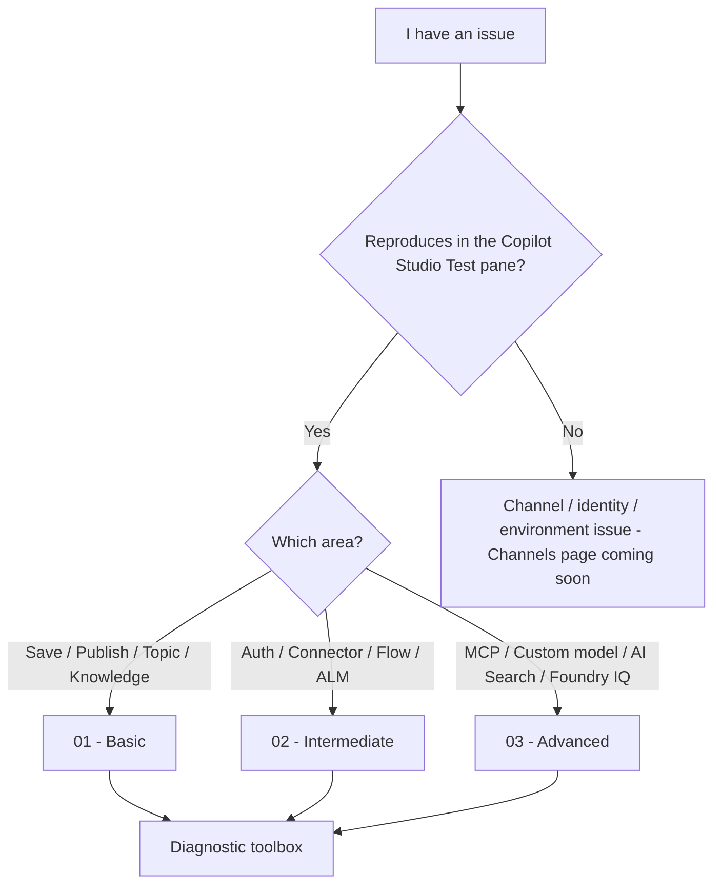

# Troubleshooting Copilot Studio

A practical, **0-to-hero** troubleshooting guide for **makers and builders** of **Copilot Studio agents** — covering issues you hit while authoring, testing, publishing, and operating them in the **Copilot Studio portal** and across channels.

> [!TIP]
> **Golden rule:** Before you go anywhere else, **try to reproduce the issue in the Copilot Studio Test pane**. If it doesn't reproduce there, it's almost certainly channel-, identity-, or environment-specific — not an agent design issue.

## Where do I start?

## How this guide is organized

**Severity legend:** 🟢 self-serve (the maker can fix it) · 🟡 needs an admin (environment, tenant, Entra) · 🔴 needs Microsoft support (service-side bug, capacity, identity).

| # | Page | Severity | When to use it |
|---|------|:---:|----------------|
| 00 | [Diagnostic toolbox](./00-diagnostic-toolbox.md) | — | First stop. The tools you'll reuse across every issue (Test pane, Activity map with orchestrator rationale, Application Insights, Power Platform Admin Center, Solution Checker, browser network trace). |
| 01 | [Basic (Portal)](./01-basic.md) | 🟢 | Day-1 issues: sign-in / licensing, agent won't save or publish, topic not triggering, knowledge not returning answers, Test pane errors. |
| 02 | [Intermediate (Portal)](./02-intermediate.md) | 🟢 🟡 | Authentication (Entra / OAuth), connectors and Power Automate flows, variables / slot filling, custom entities, environments and solutions, Application Insights basics. |
| 03 | [Advanced (Portal)](./03-advanced.md) | 🟡 🔴 | MCP tools, custom / fine-tuned models, Azure AI Search integration, Foundry IQ agentic retrieval, generative orchestration debugging, prompt and instruction tuning. |
| 04 | Channels | — | *Coming soon* — Teams, Microsoft 365 Copilot, Web / Direct Line, Telephony, custom website embed. |

## Minimum context to collect

Before you dig in (or ask for help), gather these. Most basic and intermediate issues are solved just by going through the list.

1. **Symptoms** — exact error text, what you see vs what you expected.
2. **Repro steps** — the minimal sequence that triggers the issue.
3. **Where it happens** — authoring canvas, Test pane, demo webpage, Teams, Microsoft 365 Copilot, custom website, Direct Line, telephony.
4. **Conversation id** of a failing turn — grab it in the Test pane with `/debug conversationId` (see [Diagnostic toolbox §1](./00-diagnostic-toolbox.md#1-test-pane)).
5. **Environment** — name, region, type (production / sandbox / Dataverse-for-Teams / developer).

## How to ask for help

When the guide doesn't cover your case, paste the [minimum context](#minimum-context-to-collect) above plus:

- Link to the closest matching card (or "no card matched").
- Output of `/debug conversationId` from the Test pane (see [Diagnostic toolbox §1](./00-diagnostic-toolbox.md#1-test-pane)).
- A **Test pane snapshot** of the failing conversation (see [Download a Test pane snapshot](./00-diagnostic-toolbox.md#download-a-test-pane-snapshot)).
- A redacted screenshot of the failing screen / error banner.
- (If a portal action) a redacted HAR file — see [Reading a HAR / network trace](./03-advanced.md#reading-a-har--network-trace).

> [!NOTE]
> Building a **declarative agent** in the Microsoft 365 Copilot UI / Teams, an **Agent Builder** agent in Power Apps, or a **Power Pages** agent? Those experiences have different publish workflows and ownership; this guide isn't tailored to them.
