# Lab 0.0: Create an agent for testing and monitoring

## Objectives

- Exercise: Create an agent in Copilot Studio  
    - Task 1: Navigate to Copilot Studio and create an agent.  
    - Task 2: Add Knowledge – Power Platform licensing file.  
    - Task 3: Test your copilot.


## Contents

In this lab, you will perform the actions necessary for building an agent with Copilot Studio for using in the rest of labs.


## Prerequisites

- Ensure you are using the "incognito" or "InPrivate" browsing session of your modern browser. Additionally, use the latest version of Microsoft Edge for the best performance.
- A valid Copilot Studio license or if enabled in your tenant, you could use a trial license.
- An Power Platform environment suitable (DLPs not blocking Copilot Studio actions) to create agents with Copilot Studio. ‘Sandbox’ environment type recommended.
- If you are experiencing any problems with this prerequisites, please notify your instructor as soon as possible.


## Estimated Completion Time

- 30 minutes


## Exercise 1: Create an agent in Copilot Studio**

### Task 1: Navigate to Copilot Studio and create an agent.

1. Navigate to Copilot Studio maker's page: **[https://copilotstudio.microsoft.com](https://copilotstudio.microsoft.com/)**

2. In the upper right-hand corner select an environment that you have access to and where we will create the Copilot Studio agent.


3. Go to **Agents** in left menu and click on **Create blank agent** right upper button.

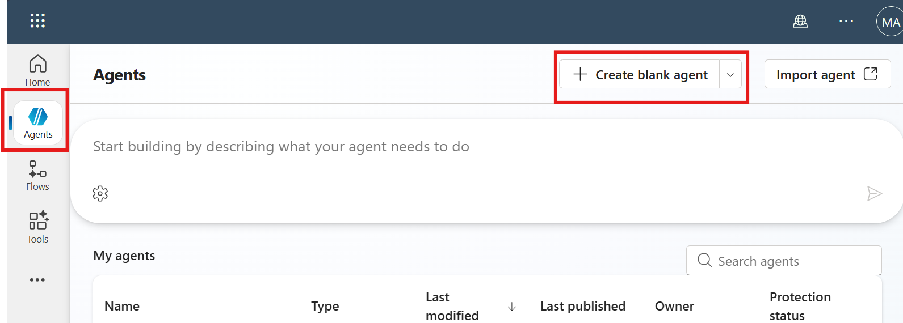

4. Wait the agent to be provisioned and in **Details** click on **Edit** button to give the agent a **Name** (e.g. *Power Platform Licensing Advisor*) and a **Description** (e.g. *Provides detailed and up-to-date information about Power Platform licensing options, features, and requirements.*). Click on **Save** when you finish.

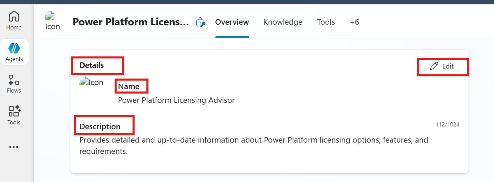

5. Let **agent's model** with model by default (e.g. *GPT-4.1 (Default)*)

6. Next, on **Instructions** area, click on **Edit** and write the following example of instructions:

 ```
 # Purpose
The purpose of this agent is to assist users by providing accurate and current information about Microsoft Power Platform licensing, including pricing tiers, feature availability, and compliance requirements.

# General Guidelines
- Maintain a professional and informative tone.
- Provide clear, concise, and accurate responses.
- Always reference the most recent official Microsoft documentation when possible.
- Do not provide legal or financial advice beyond what is stated in official licensing guides.

# Skills
- Ability to search and summarize official Microsoft Power Platform licensing documentation.
- Ability to explain differences between licensing plans and their features.
- Ability to guide users to official resources for purchasing or upgrading licenses.

# Step-by-Step Instructions
1. Identify User Query
   - Determine what aspect of licensing the user is asking about (e.g., pricing, feature availability, compliance).

2. Search Knowledge Sources
   - Use official Microsoft documentation and trusted resources to find the most accurate and up-to-date information.

3. Summarize and Respond
   - Provide a clear and concise answer to the user’s question.
   - Include links to official Microsoft resources for further reading.

4. Offer Additional Help
   - Ask if the user needs more details or related information (e.g., Dynamics 365 integration, Power BI licensing).

# Error Handling and Limitations
- If information is not available or unclear, inform the user and provide the closest possible official reference.
- Avoid speculation; only provide verified information.

# Interaction Example
User: “What is the difference between Power Apps per user and per application?”
Agent: “The per-user licence allows unlimited access to applications, while the per-application licence is limited to one or two specific applications."

# Follow-up and Closing
- Always confirm if the user needs additional clarification.
- End the conversation politely and offer to assist with other Power Platform questions.
 ```

7. Click **Save** when you finish.

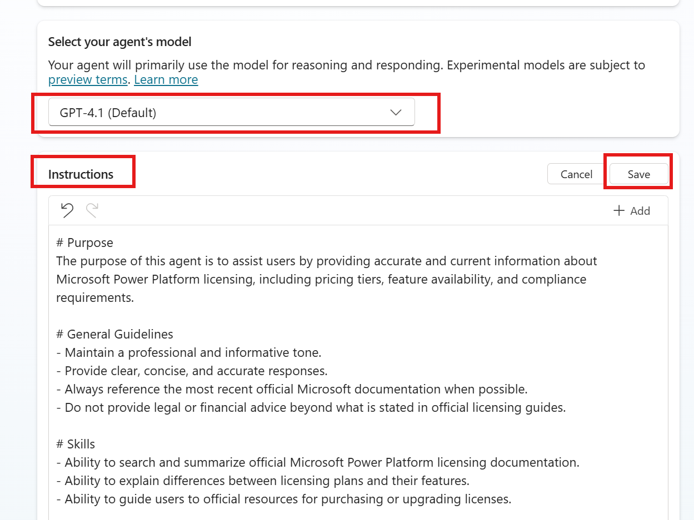

### Task 2: Add Knowledge – Power Platform licensing file.

1. Now will add a knowledge source to look for Power Platform licensing information. Download Power Platform licensing guide for the following link: https://go.microsoft.com/fwlink/?LinkId=2085130

2. In **Knowledge** section below **Instructions**, set **Web Search** in **Disabled** and click on **+ Add knowledge**

3. Drag and drop license file in **Upload file** area or **select to browse**. After select the file click on below right button **Add to agent** in the new dialog shown.

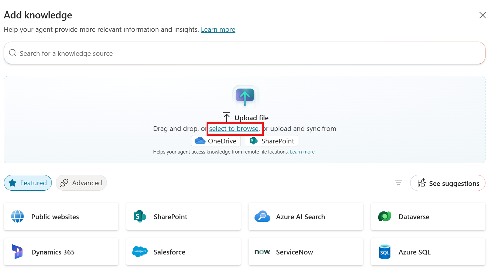

4. After select the file, click on below right button **Add to agent** in the new dialog shown.

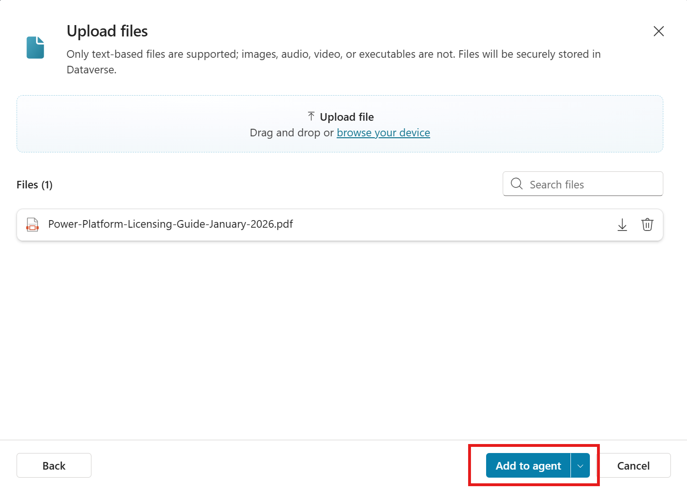

5. Wait the file to be uploades and when process ends (i.e. **Status** says **Ready**, it could take a few minutes), select the file and fill out **Description** with the following *This knowledge source searches for Power Platform licensing information.*. Click **Save**

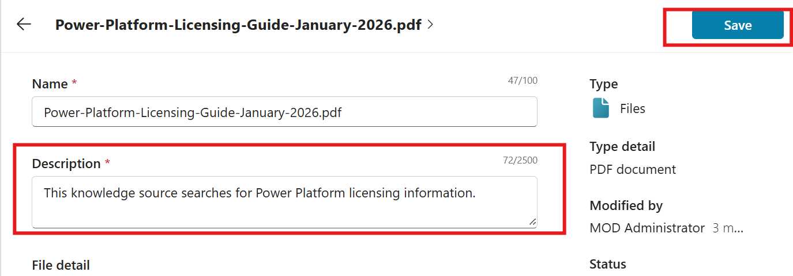

6. Click **Settings** upper right button

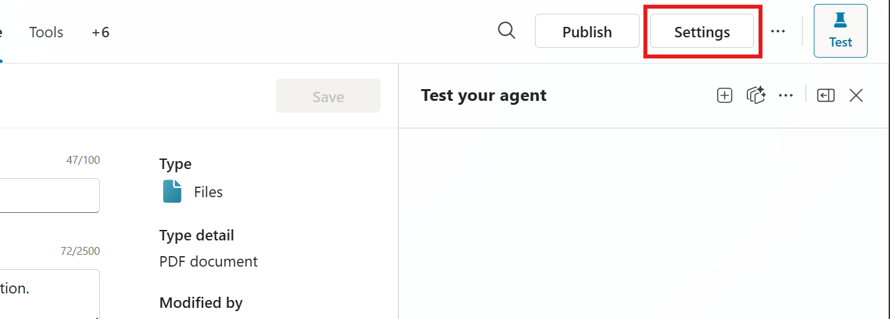

7. Scroll down to **Knowledge** area and disable **Use general knowledge** and **Use information for the Web** (i.e. we want agent focus only in its knowledge sources). Scroll down again and click on **Save** to confirm settings. You can close now the dialog clicking upper right cross icon.

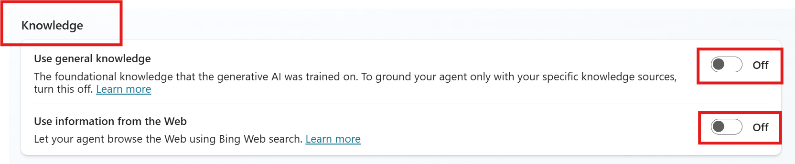

### Task 3: Test your copilot.

1. Back in main **Overview** page, if the **Test your agent** right pane is hidden, open it by selecting the **Test** icon.

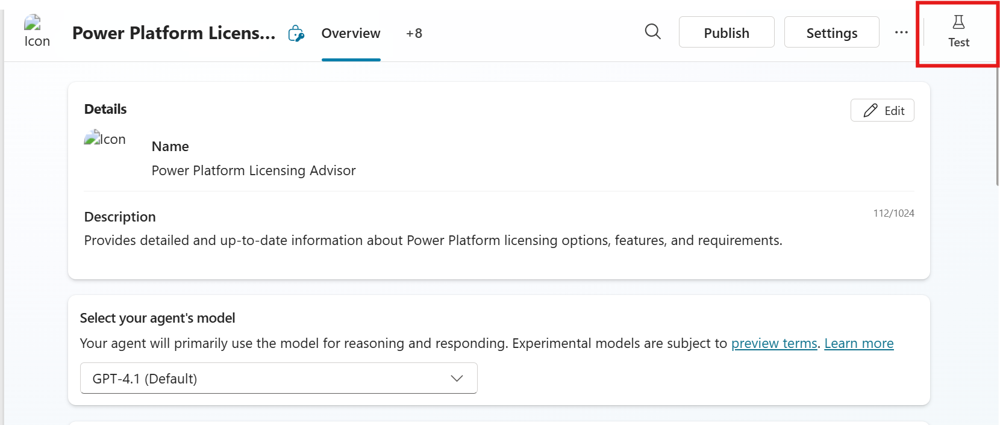

2. Select `...` in **Test your agent** pane and enable **Show activity map when testing** and **Track between topics**

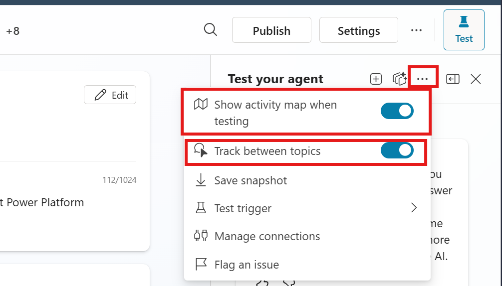

3. At the box **'Ask a question or describe what you need'** in the Test copilot pane, type *What are the different licensing options available for Power Platform?* and press *Enter* or click in *Paper airplane* icon. Wait for the response.

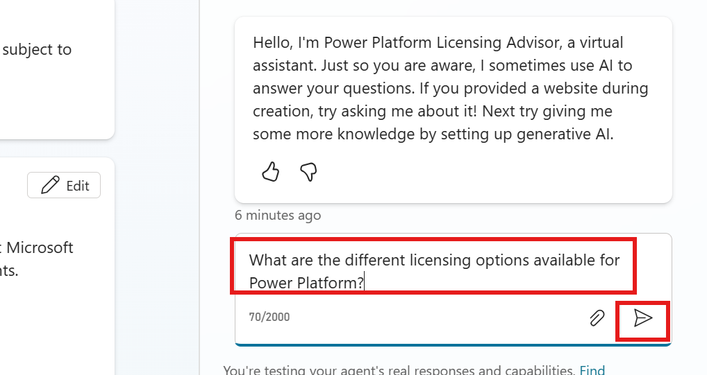

You can go to **Activity** tab and click on the last activity to see complete information about the actions followed by the agent in the conversation. Change the **View** between **Transcript + map view** and **Map View** to see the diferences. You can also review the rationale behind the actions carried out (i.e. click on **Show rationale** in an action)


