# Lab 1.4: Use Azure AI Search in Copilot Studio

## Objectives

Learn how to create an agent, leverage AI Search as a knowledge source, and understand the value this tool provides.

## Contents

In this lab, you will perform the actions necessary to connect Azure AI Search to your Copilot Studio agent and use it to generate responses.

## Prerequisites

It's required to have completed **[Lab 0.0 - Create an agent](../0.0-create-an-agent/0.0-create-an-agent.md)** to follow this part.

## Estimated Completion Time

30 minutes

## Exercise 1: Create an agent in Copilot Studio

### Task 1: Navigate to Copilot Studio and create an agent.

1.	Navigate to Copilot Studio maker's page: https://copilotstudio.microsoft.com
2.	In the upper right-hand corner select an environment that you have access to and where we will create the Copilot Studio agent. 

    

     
    
3.	Select **Create** and select **New agent**.

    
    
     

    > Note: Generative AI may not always ask the exact same questions to create the agent.

     

4.	In the prompt add **"This agent helps users with question related to Power Platform licensing"** then press Enter.
5.	When asked " Great! Now let's determine a name for this agent. How about "Power Platform Licensing Assistant"? Please confirm or suggest another name." answer **"Yes."** 
6.	 When asked ‘Now, let's refine the instructions for the Power Platform Licensing Assistant. First, let's define what the agent should do. For example, "Provide detailed information about Power Platform licensing options and answer user queries related to licensing." What specific actions or behaviours should the agent perform?’ answer **"This agent provides users with information and answers questions related to Power Platform licensing, including pricing, features, and subscription options."**
7.	When asked “The Power Platform Licensing Assistant is now set up to assist users with questions related to Power Platform licensing, including pricing, features, and subscription options. Would you like to add any publicly accessible data sources for this agent? This step is optional.” Answer **“No”**
8.	Now you can select Create. 

    

     

    > Note: Wait for setup to complete..

     

9.	In **“Details”** section, take a look to **“Name”**, **“Description”** and **“General instructions”**. You can edit the description and general instruction to refine the behaviour the agent. Enable the use of generative AI to determine how to best respond. 

    

 ## Exercise 2: Use Azure AI Search as knowledge source

### Task 1: Create Azure AI Search configuration

1. Open Azure portal and go to your Azure subscription. As first step we will create a new storage account to store a pdf file containing our last platform license guide "Power-Platform-Licensing-Guide-MMMM-YYYY.pdf" (https://go.microsoft.com/fwlink/?linkid=2085130). Go to search bar and look for storage accounts service, click on it.

    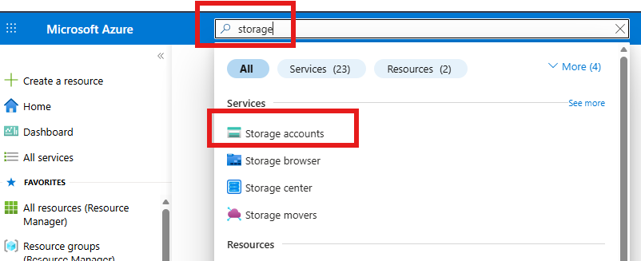

     

2. Create a new storage account (click **Create**)

    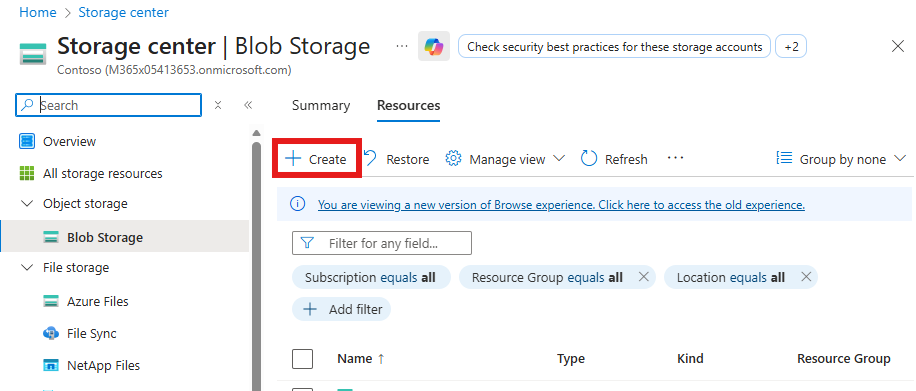

     

    Configure the storage account with the following details:

    - Subscription: your Azure subscription
    - Resource Group: click on *Create new* and give a name, i.e. **rgAISearch** (should be the same for the rest of resources)
    - Storage account: An unique name, i.e. **saaisearchyouralias**
    - Region: Choose someone you want (recommended close to your location). Try to use this region for the rest of resource.
    - Preferred storage type: **Azure Blob Storage or Azure Data Lake Storage Gen 2**
    - Primary workload: **Machine learning and artificial intelligence**
    - Performance: **Standard**
    - Redundancy: **Locally-redundant storage (LRS)** (lowest cost option)

    Click **Review + create**, wait for the review, when finish click **Create** and wait for the deployment finish.

    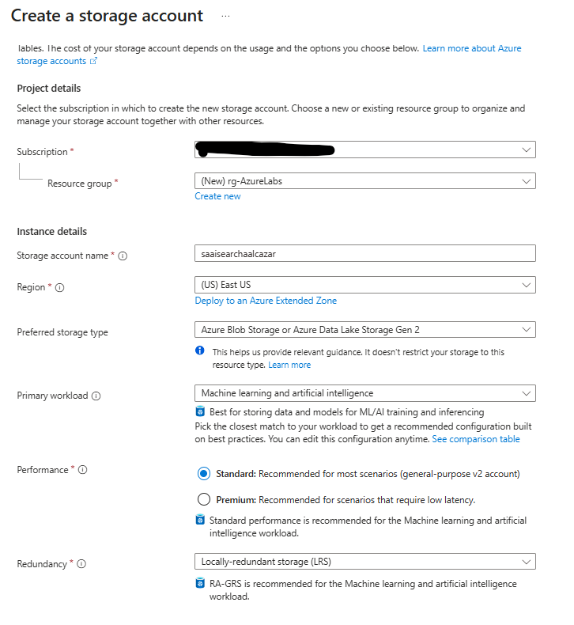

     

    Once deployment is complete click **Go to resource**.

3. Set permission for the storage account

    We have to assign permissions to manage the storage (normally is not needed but maybe sometimes when you have to do it depending of Azure policies). On left menu click on **Access Control (IAM)**

    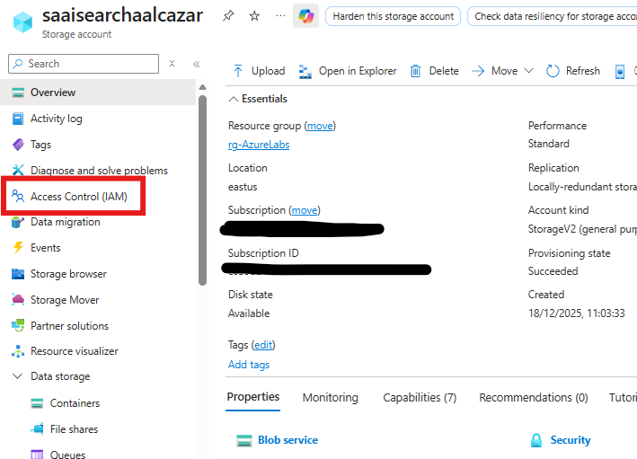

     

    On the tile **Grant access to this resource** click on **Add role assignment** button inside the tile. In the new page, look for the role of **Storage Blob Data Owner** (you can look for also if you want for role **Storage Blob Data Contributor** that has less priviledges). Select the role and click **Next** button below in the page.
    
    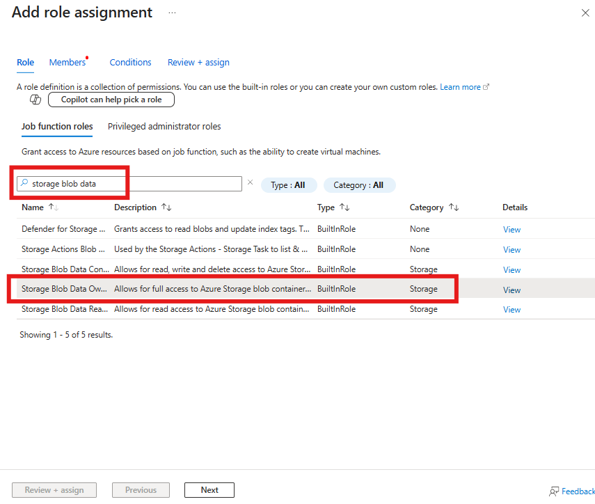

     

    Now we have to select ourselves for the role, so click in **+ Select members** and seek for you. Click **Select** and **Next** in the **Add role assignment** page.
        
    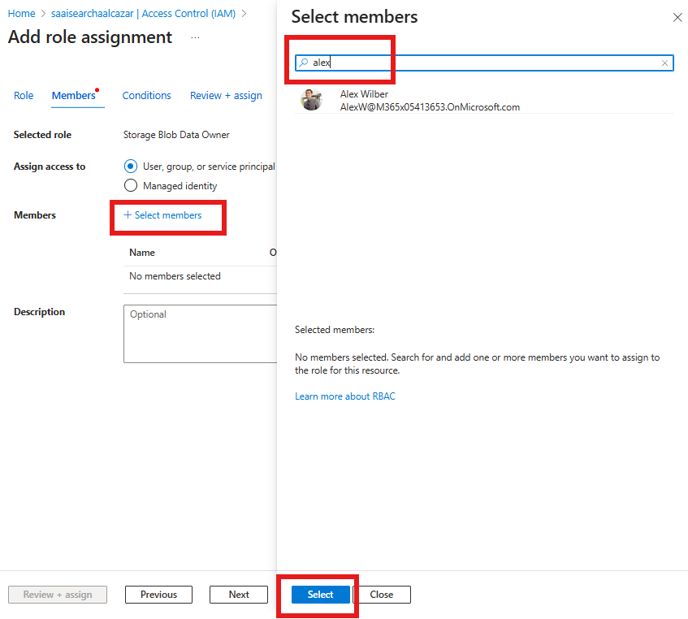

     

4. Add a container to the Azure Storage

    We have to create a container inside the storage where we will upload our licensing file. On left menu of your storage resource, find **Containers** in the group of **Data storage** and click on it.

    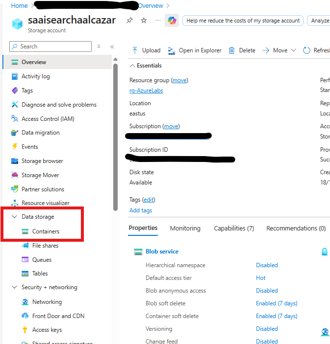

     

    Click on tab **Add container** and set a **Name** for the container (i.e. **cs-licensingdocs**). Click on **Create**

    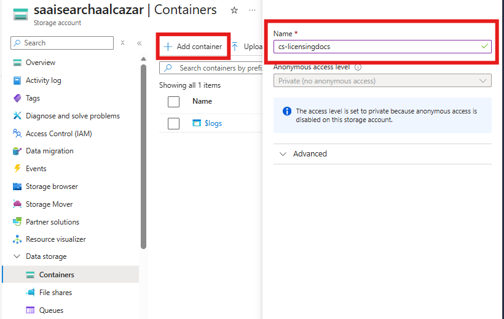

       

    Select the container you have created and click the tab **Upload** and **Browse for files** in order to upload our file of Power Platform licensing (https://go.microsoft.com/fwlink/?linkid=2085130). Select **Upload** to finish.

    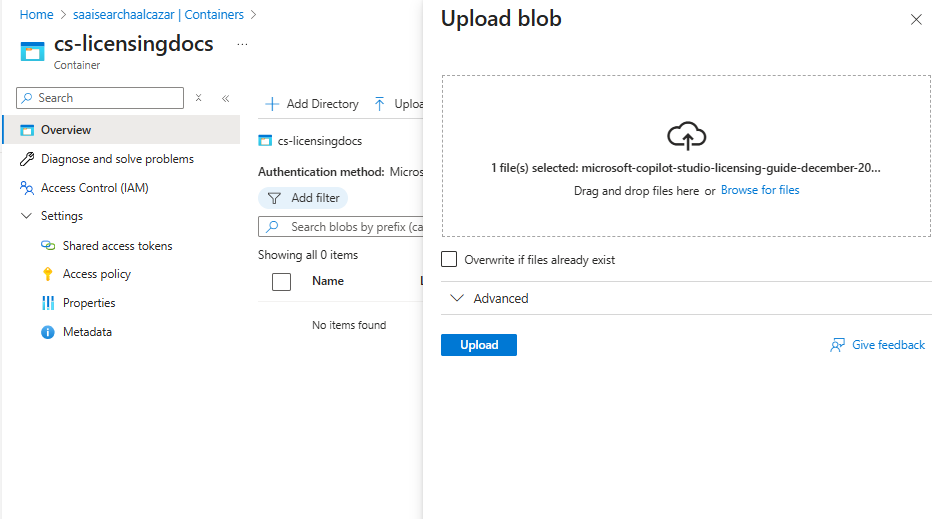

     

    > **Note** If you are using an Azure subscription for which you are not an administrator, key-based access to storage may have been disallowed by policy. In this case, you’ll need to configure your container to use Entra ID authentication method to access storage (remember in this case you will need then **Storage Blob Data owner or Contributor** role to access. Check former task).
    >
    >   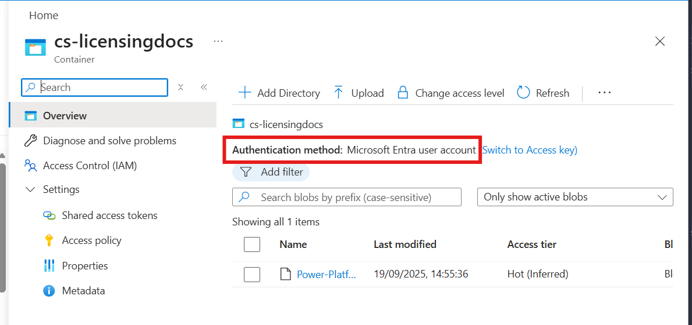

     

5. Create Open AI resource

    Next step is to generate the embeddings for our Power Platform licensing file. For that it is needed an *Embeddings Model* and we will deploy the model in Azure Open AI. So go again search for an **Azure OpenAI** resource in the upper Azure toolbar and click on it.

   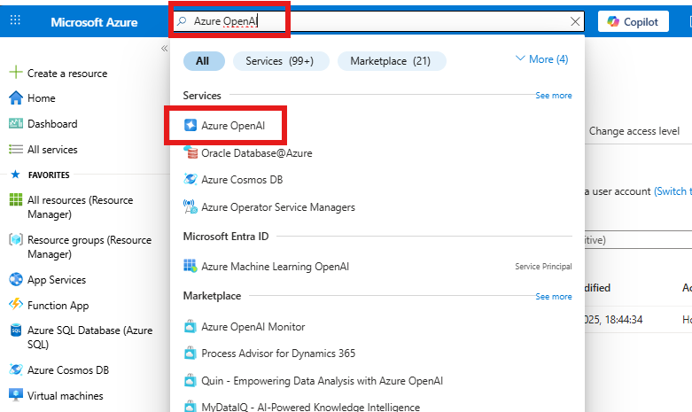

     
    
    In the Azure OpenAI page, click on **Create**, select **Azure OpenAI**, and configure the resource with the following:

    - Subscription: same as Storage
    - Resource group: same as Storage
    - Region: same as Storage
    - Name: a unique name for your resource (i.e. **openAIlabyouralias**)
    - Pricing tier: S0 Standard

    Click **Next** and continue to click the **Next** button until last page, clicking **Create** button. Wait for the deployment to finish and after **Go to resource**.

    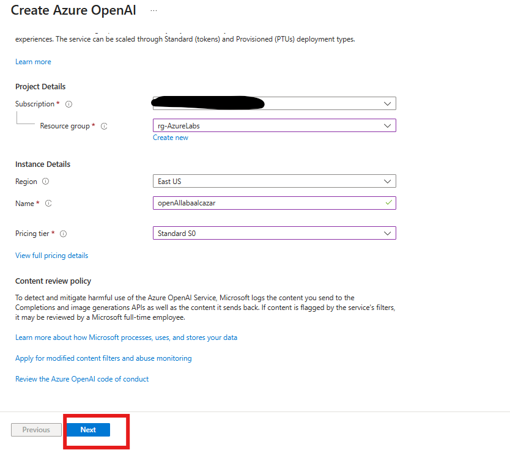

     

    Navigate to Foundry portal clicking on **Go to Foundry portal** in your Open AI resource.

   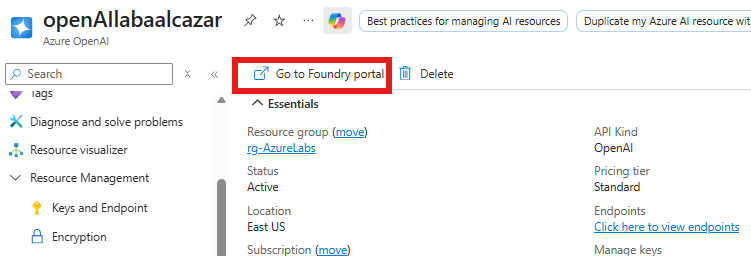

     

    On left menu of your Foundry Portal, find **Deployments** in the group of **Shared resources** and select it. After click on **Deploy model** and **Deploy base model**

    

     

    Seek in the Searh box for a **text** model, select one of those (i.e. **text-embedding-3-large**) and **Confirm**

   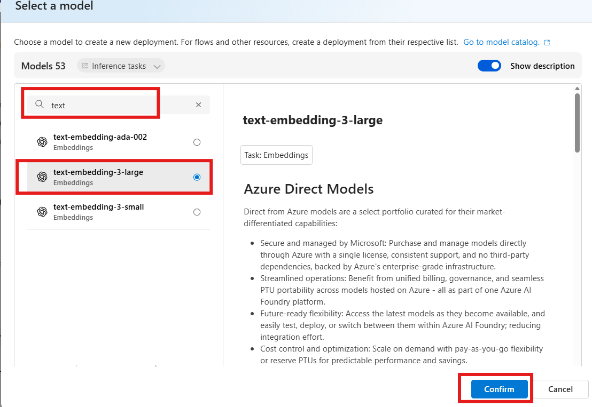

     

    Click **Deploy** in the dialog that pops up.

6. Create an Azure AI Search resource

    Back in Azure portal, select AI search in the upper search text box

    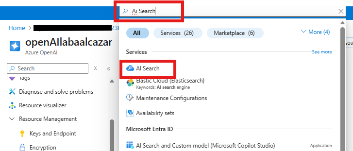

     

    On the page of **Microsoft Foundry** for **AI Search** (check left menu to confirm) select **Create** and configure with the following settings:

    - Subscription: same as Storage and OpenAI
    - Resource group: same as Storage and OpenAI
    - Service name: unique name of your choice (i.e. **aisearchlabsyouralias**)
    - Location: same as Storage and OpenAI
    - Pricing tier: **Free** (you have to **Change Pricing Tier**)

    Click of **Review + create** and **Create**.

   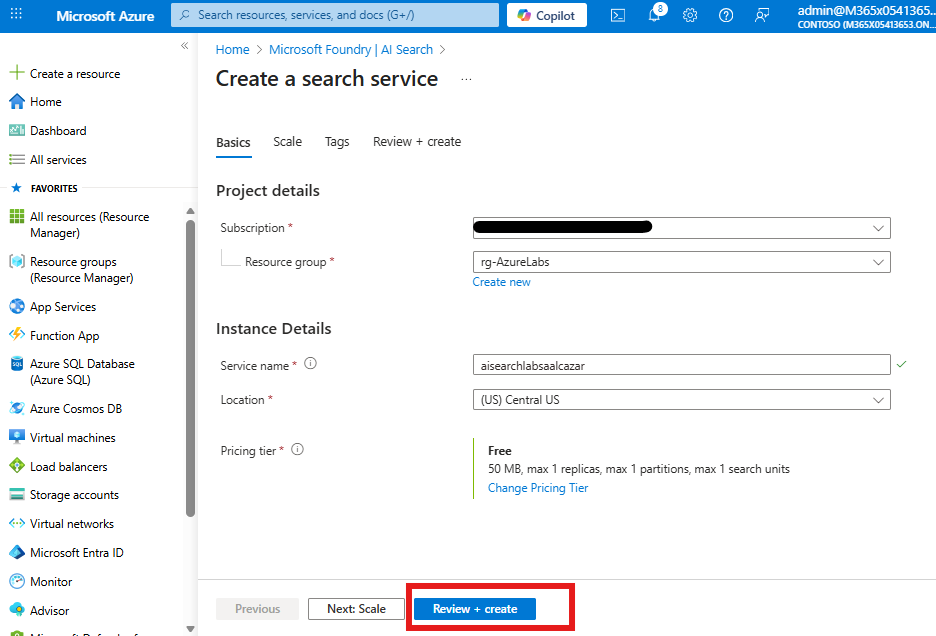

     

    Wait until the deployment finish and select **Go to resource**

7. Vectorize Data (our licensing file) in Ai Search

    Final step in our configuration is to create a search index which includes our licensing file. In AI Search page click on tab **Import data (new)** select **Azure Blob Storage** and after select **RAG**. Next, configure your RAG with the following settings and click **Next**:

    - Subscription: same as AI search and rest of resources in this lab
    - Storage account: our Storage account with licensing file
    - Blob container: our container inside the storage account
    - Blob folder: Leave empty
    - Parsing mode: Leave *Default*

   

     

    Next, define how the document' text will be vectorized (we only have a model for that). Set the following settings:

    - Kind: leave *Azure OpenAI*
    - Subscription: same as usual
    - Azure OpenAI service: our Open AI service we create previously
    - Model deployment: our *text-embedding-3-large*, What else?
    - Authentication type:

    **Check** to acknowledge connecting to an Azure OpenAI service will incur in additional costs and click **Next** and skip the pages (clicking **Next**) for *Vectorize and enrich your images* and *Advance settings**. Finally select **Create**

    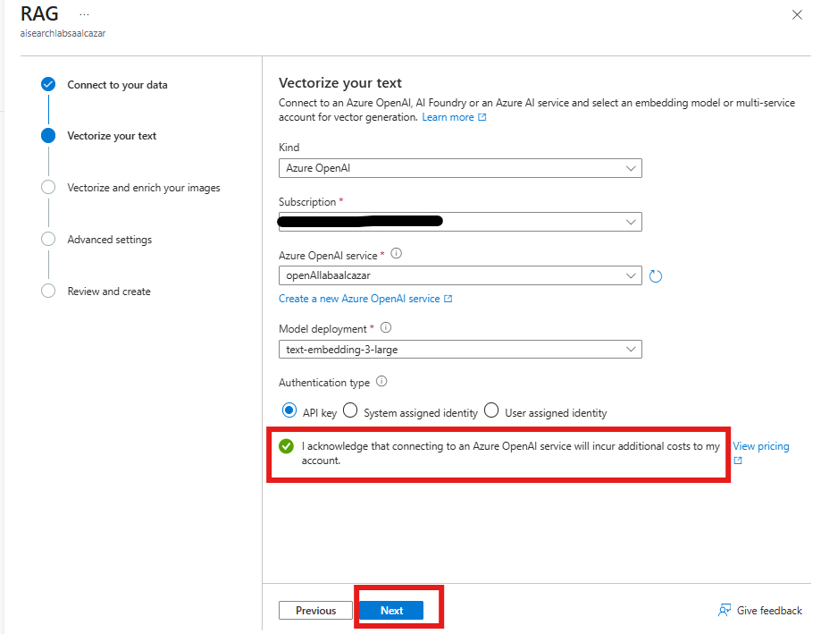

     

    A dialog pops up showing your index has been created.

### Task 2: Connect agent to Azure AI Search

1.	To connect our agent to Azure AI Search we will need its **endpoint url** and an **admin key**. For the **url** you can find and copy it at the **Overview** page in Azure AI Search Service

    

     
 
    and for **admin key**, you can find that in **Keys** page. You can copy one of two indifferently

     

     

     
 
2. Back to our **Licensing Assistant** agent in Copilot Studio, go to the agent's **Knowledge tab**, click **"Add Knowlege"** button and select **Azure AI Search** in the dialog that appears.

   

    

3. You will have to **create a new connection** and **Add to agent**
   
   

    

You are now ready to test your agent using Azure AI Search as Knowledge source

### Task 3: Use Azure AI Search in you agent

1. If the **Test copilot** pane is hidden by default, open it by selecting the Test icon.
 

 

2.	Select ... next to the Copilot reset button

 
  
3.	At the box **'Ask a question or describe what you need'** prompt in the Test copilot pane, type ‘What are the different licensing options available for Power Platform?’.
 
    

 

Notice that 'Activity map’ is displaying along with the answer in Test Pane. Azure AI Search as knowledge source has been used.

Lab is now completed, well done!!!. You can move to the next lab

